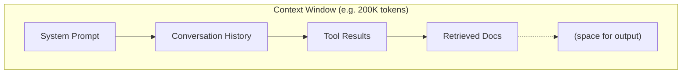
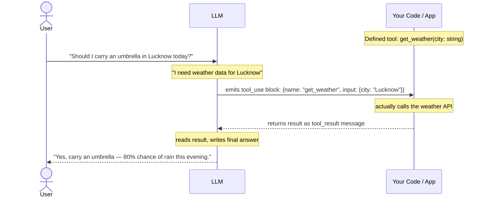

# Module 1: LLM Fundamentals & Tool Calling

> **Goal of this module:** Build a rock-solid mental model of how an LLM actually processes and generates text, and understand the mechanism (tool/function calling) that lets it act on the world. Everything in later modules — agents, RAG, memory, MCP — is built on top of these primitives. If this module is shaky, everything after it will feel like magic instead of engineering.

---

## 1. What is a Token?

A **token** is the basic unit of text an LLM reads and writes. It is *not* the same as a word.

- "unbelievable" might be split into `un`, `believ`, `able` — 3 tokens.
- "ChatGPT" might become `Chat`, `G`, `PT`.
- Common short words ("the", "is", "and") are usually a single token.
- Punctuation, whitespace, and even parts of numbers can be separate tokens.

**Why not just use words?**
- Vocabulary would explode (every language, every misspelling, every rare word = new entry).
- Subword tokenization (e.g., **Byte Pair Encoding (BPE)**, **SentencePiece**) lets the model handle *any* string, including words it's never seen, by falling back to smaller pieces or even individual bytes.

**Rule of thumb (English):** 1 token ≈ 4 characters ≈ ¾ of a word. So 100 tokens ≈ 75 words.

**Why this matters practically:**
- API pricing is per token (input + output).
- Context window limits are measured in tokens, not characters or words.
- Non-English languages (especially non-Latin scripts like Hindi, Chinese, Arabic) often use *more* tokens per word than English — this affects both cost and how much content fits in a context window.

```
"Agentic AI is powerful"
        ↓ tokenizer
["Agent", "ic", " AI", " is", " powerful"]
        ↓ token IDs
[10659, 292, 15592, 374, 8147]
```

The model never sees text — it only ever sees a sequence of integers (token IDs), which get mapped to embedding vectors internally.

---

## 2. Context Window

The **context window** is the maximum number of tokens (input + output combined) a model can "see" and reason over in a single request.

- Example: a 200K context window model can take in a 150K-token document and still has 50K tokens left for its response.
- Once you exceed the window, either the request fails, or older content gets silently truncated/dropped depending on how the API/framework handles it.

**Why it matters for agentic systems specifically:**
- Every tool call result, every conversation turn, every retrieved document chunk — all of it eats into the same shared context budget.
- A long-running agent that keeps appending full tool outputs to its history will eventually blow the context window. This is *the* central design constraint of agent memory systems (see Module 3).
- "Context isn't free" — bigger context ≠ better; irrelevant content in context can actually *degrade* output quality (this is sometimes called "context rot" or the "lost in the middle" problem — models attend less reliably to information buried in the middle of a very long context).



**Design implication:** agentic systems need strategies to manage this budget — summarization, truncation, selective retrieval — instead of just "shoving everything in."

---

## 3. Prompting

A prompt is the input you give the model. In production systems, prompts usually have structure:

| Role | Purpose |
|---|---|
| `system` | Sets behavior, persona, constraints, available tools. Set once, applies to whole conversation. |
| `user` | The human's input. |
| `assistant` | The model's previous responses (included so the model has conversational memory within the window). |
| `tool` / `function` | Results returned from a tool call, fed back to the model. |

**Core prompting techniques worth knowing cold:**

- **Zero-shot** — just ask, no examples.
- **Few-shot** — give 2-5 examples of input→output before the real query. Dramatically improves consistency for structured tasks.
- **Chain-of-Thought (CoT)** — ask the model to "think step by step" before answering. Improves reasoning-heavy tasks (math, logic, multi-step planning).
- **System prompt engineering** — the system prompt is where you define agent persona, tool usage rules, output format constraints, and guardrails. In agentic systems this is often the single highest-leverage piece of text in the whole pipeline.

**Interview-relevant distinction:** prompting is *inference-time* behavior shaping (no weight changes); fine-tuning is *training-time* (weights change). See section 6.

---

## 4. Temperature, Top-p, Top-k

At each generation step, the model produces a probability distribution over its entire vocabulary for "what token comes next." These three parameters control how that distribution is sampled.

- **Temperature** — scales the distribution before sampling.
  - `temperature = 0` → nearly deterministic, always picks the highest-probability token (greedy decoding). Good for extraction, classification, code generation, tool-calling — anywhere you want repeatability.
  - `temperature = 1` → sample proportionally to the model's natural distribution.
  - `temperature > 1` → flattens the distribution, more randomness/creativity, higher risk of incoherence.

- **Top-k** — only consider the *k* most likely next tokens, discard the rest, then sample among those.
  - `top_k = 1` is equivalent to greedy decoding.

- **Top-p (nucleus sampling)** — instead of a fixed count, take the smallest set of tokens whose cumulative probability ≥ p, and sample from that set. Adapts dynamically: if the model is very confident, the set is small; if uncertain, the set is larger.

**Practical agentic-system rule:** for tool-calling and structured-output steps, use low temperature (0–0.2). For creative/brainstorming steps, higher temperature (0.7–1.0) is fine. Mixing these correctly across a multi-step agent pipeline is a real production decision, not a detail.

---

## 5. Function / Tool Calling

This is the single most important mechanical concept for agentic AI — it's the bridge between "model that predicts text" and "system that takes action."

**The core idea:** you describe available functions to the model (name, description, parameter schema) in the request. Instead of always replying with plain text, the model can reply with a *structured request* to call one of those functions with specific arguments. Your code executes the actual function (the model never runs code itself), then you send the result back to the model as a new message, and the model continues.



**Key facts:**
- The model doesn't execute anything. It only ever outputs *text describing what it wants called and with what arguments*. Your application layer is responsible for actually running it and handling failures.
- A single response can request **multiple tool calls** (parallel tool use), which your code can execute concurrently.
- The model decides *whether* to call a tool at all — if it can answer directly, it should (well-designed prompts/tool descriptions steer this).
- This is the exact mechanism agents use in Module 2's action loop, and it's what MCP (Module 4) standardizes across different tool providers.

**Minimal Python example (Anthropic API):**

```python
import anthropic

client = anthropic.Anthropic()

tools = [
    {
        "name": "get_weather",
        "description": "Get current weather for a given city",
        "input_schema": {
            "type": "object",
            "properties": {
                "city": {"type": "string", "description": "City name"}
            },
            "required": ["city"]
        }
    }
]

response = client.messages.create(
    model="claude-sonnet-4-6",
    max_tokens=1024,
    tools=tools,
    messages=[{"role": "user", "content": "Should I carry an umbrella in Lucknow today?"}]
)

# Check if the model wants to call a tool
for block in response.content:
    if block.type == "tool_use":
        print(block.name, block.input)
        # -> "get_weather" {"city": "Lucknow"}
        # Your code now actually calls the weather API,
        # then sends the result back as a tool_result message.
```

---

## 6. Structured Outputs

Sometimes you don't want the model to call a function — you just want its *final answer* to be valid, parseable data (JSON matching a specific schema), not free-form prose.

**Two common approaches:**

1. **Prompt-based** — explicitly instruct the model to "respond only with JSON matching this schema, no other text." Works reasonably well with capable models but isn't guaranteed — the model can still occasionally add preamble or break schema.
2. **Schema-enforced (constrained decoding)** — the API/framework mechanically restricts which tokens can be sampled at each step so the output *cannot* violate the schema (e.g., `response_format: json_schema` in some APIs, or using a tool-call schema itself as an output constraint). This is strictly more reliable than prompting alone.

```python
import json

response_text = response.content[0].text
clean = response_text.strip().strip("```json").strip("```")
parsed = json.loads(clean)  # always wrap in try/except in real code
```

**Why this matters for agentic systems:** every planner, router, or classifier step in an agent pipeline depends on getting back *reliable, parseable* structure — not prose you then have to regex apart. Structured outputs are the plumbing that makes multi-step agent pipelines composable.

---

## 7. Reasoning Models vs Chat Models

- **Chat/instruct models** (e.g., standard GPT-4o-class, Claude Sonnet-class calls) generate a direct response token-by-token. They *can* be prompted to "think step by step" but there's no dedicated hidden reasoning phase.
- **Reasoning models** (e.g., OpenAI's o-series, some Claude "thinking" modes) are trained/allowed to spend extra computation on an internal chain of reasoning *before* producing the final answer, often not fully shown to the user, specifically optimized for multi-step logic, math, and planning-heavy tasks.

**Trade-offs:**
| | Chat model | Reasoning model |
|---|---|---|
| Latency | Lower | Higher (extra "thinking" tokens) |
| Cost | Lower | Higher |
| Best for | Conversational, straightforward tasks, low-latency tool calling | Complex multi-step planning, hard logic/math, ambiguous problems |

**Agentic relevance:** planner/supervisor roles in a multi-agent system (Module 2) often benefit from reasoning models, while fast executor/tool-calling roles often use standard chat models to minimize latency and cost. Mixing model tiers by role is a real production pattern.

---

## 8. Fine-Tuning vs Prompting

| | Prompting (incl. few-shot, RAG) | Fine-tuning |
|---|---|---|
| When it happens | Inference time | Training time (weights updated) |
| Cost | Cheap, instant iteration | Expensive, needs data + training run |
| Best for | Instructions, format, most behavior changes, knowledge injection (via RAG) | Deep style/tone shifts, domain-specific jargon at scale, distilling a smaller/cheaper model to match a larger one's behavior, tasks where the correct output can't be reasonably described in a prompt |
| Risk | Prompt injection, context limits | Catastrophic forgetting, overfitting, needs re-training as requirements change |
| Iteration speed | Immediate | Slow (data prep + train + eval cycle) |

**Practical rule most teams follow:** try prompting + RAG first. Only fine-tune if you've hit a wall that better prompting/retrieval genuinely can't solve (e.g., needing a very specific consistent output style at scale, or needing a much smaller/cheaper model to match a larger model's quality on a narrow task).

---

## Comparisons Table: Sampling Settings by Use Case

| Task | Temperature | Notes |
|---|---|---|
| Tool calling / function selection | 0 – 0.2 | Determinism matters — you don't want the agent randomly picking different tools for the same input |
| Structured data extraction | 0 – 0.2 | Same reasoning |
| Code generation | 0.2 – 0.4 | Slight variability OK, but correctness matters most |
| Conversational chat | 0.5 – 0.8 | Natural variation feels more human |
| Creative writing / brainstorming | 0.8 – 1.2 | Want diversity of ideas |

---

## Interview-Style Q&A

**Q1: Why do LLMs use subword tokenization instead of word-level or character-level tokenization?**
Word-level would require a massive vocabulary and can't handle unseen words. Character-level keeps vocabulary tiny but makes sequences very long (expensive) and harder for the model to learn meaning from. Subword tokenization (BPE/SentencePiece) balances both — small-ish vocabulary, handles any input via fallback to smaller pieces, and common words stay as single efficient tokens.

**Q2: If a model has a 200K token context window, can you always use all 200K effectively?**
Not necessarily. Beyond raw limits, models tend to attend less reliably to information in the middle of very long contexts ("lost in the middle"). More tokens in context also means higher cost and latency. Effective context management (retrieval, summarization) usually beats "just stuff everything in."

**Q3: What's the actual difference between temperature and top-p?**
Temperature reshapes the *entire* probability distribution (makes it peakier or flatter). Top-p restricts *which tokens are even eligible* to be sampled, based on cumulative probability mass, before any sampling happens. They're often used together.

**Q4: Does the LLM execute the function during tool calling?**
No. The LLM only emits a structured request (function name + arguments) as its output. The calling application is responsible for actually executing the function and returning the result back to the model in a follow-up message.

**Q5: Why would you choose fine-tuning over better prompting?**
When the desired behavior can't be reliably captured through instructions/examples alone — e.g., you need consistent domain-specific tone/style at scale, or you want a smaller/cheaper model to match a larger model's behavior on a narrow, well-defined task (distillation). Fine-tuning is a bigger investment (data + training + re-training on requirement changes), so it's usually a last resort, not a first move.

**Q6: What's the practical risk of always using temperature=1 for an agent's tool-calling step?**
Non-determinism in tool selection/argument formatting can cause inconsistent or invalid tool calls, flaky pipeline behavior, and harder debugging. Agentic systems generally want low or zero temperature for any step where you need reliable, repeatable structured output.

**Q7: What is a reasoning model optimized for that a standard chat model isn't?**
Extended internal computation/deliberation before producing a final answer — better suited to multi-step logic, math, and complex planning, at the cost of higher latency and token cost.

**Q8: Why does structured output matter more in agentic pipelines than in a simple chatbot?**
Agentic pipelines chain multiple LLM calls together (planner → router → executor → critic). Each step's output often becomes the next step's input. If that output isn't reliably parseable, the whole chain becomes brittle. Prose output is fine for a single final chatbot answer to a human; it's a liability between pipeline stages.

---

## What's Next

**Module 2: Agentic Core** — the agent loop (Reason → Act → Observe → Repeat), ReAct pattern, single vs multi-agent architectures, planner/executor/supervisor/critic roles, and reflection. This is where tool calling (from this module) becomes the mechanism an autonomous agent uses to actually get things done.
