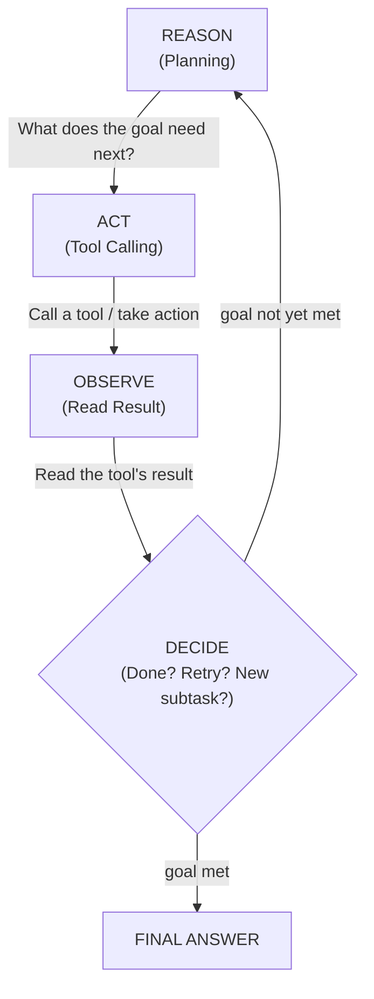
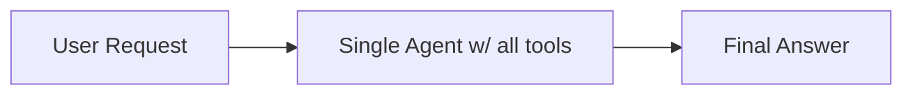
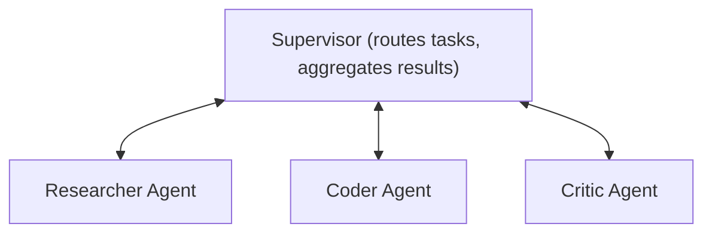
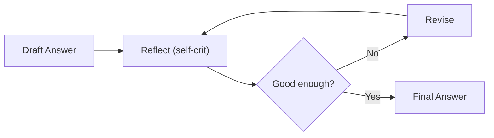

# Module 2: Agentic Core

> **Goal of this module:** Understand what actually makes a system "agentic" as opposed to just "an LLM with tools." This is the central module of the whole handbook — memory (Module 3), MCP (Module 4), and RAG (Modules 5–7) are all things an agent *uses*; this module is about the agent itself: how it decides what to do, how it acts, how it checks its own work, and how multiple agents coordinate.

---

## 1. What Makes Something "Agentic"?

A plain LLM call is: **input → output**. One shot, no state, no action on the world.

An **agent** adds a loop around the LLM: it can decide an action is needed, take that action (via tool calling, from Module 1), observe the result, and decide again — repeating until the task is done, not just until one response is generated.

**The core definition worth memorizing for interviews:**
> An agent is an LLM operating in a loop, with the ability to use tools, observe results, and make decisions about what to do next, working toward a goal with some degree of autonomy — rather than producing a single fixed response.

The three ingredients that separate "agentic" from "just prompting":
1. **Autonomy** — the system decides its own next step, rather than following a hardcoded script.
2. **Tool use** — it can act on the world (search, call APIs, write files, query databases), not just generate text.
3. **Iteration** — it can observe the outcome of its own actions and adjust, rather than stopping after one pass.

---

## 2. The Agent Loop

This is the single most important diagram in this entire handbook — nearly everything else is a variation or extension of this loop.



Every "agent framework" you'll encounter (LangGraph, CrewAI, AutoGen, custom loops) is, underneath, an implementation of this loop with different amounts of structure, guardrails, and multi-agent orchestration wrapped around it.

**Why this loop, and not just one big prompt?**
Because most real tasks aren't answerable from the model's parametric knowledge alone, and aren't solvable in one step. "Book me the cheapest flight to Dubai next month that arrives before 6pm" requires: search flights (action) → read results (observation) → filter by arrival time (reasoning) → maybe search again with different filters (another action) → present the answer. A single-shot prompt cannot do this; a loop can.

---

## 3. ReAct (Reason + Act)

**ReAct** is the foundational pattern (from the 2022 paper "ReAct: Synergizing Reasoning and Acting in Language Models") that most agent loops are built on. Instead of the model either purely reasoning (chain-of-thought) *or* purely acting (tool calls) in isolation, ReAct interleaves them explicitly, and — critically — the model's reasoning is visible text ("Thought:") that precedes each action, which improves both accuracy and debuggability.

```
Thought: I need to find out the current weather in Lucknow to answer this.
Action: get_weather(city="Lucknow")
Observation: {"condition": "Rain", "chance": "80%"}
Thought: 80% chance of rain means the user should carry an umbrella.
Final Answer: Yes, carry an umbrella — 80% chance of rain today.
```

**Why the explicit "Thought" step matters:**
- It forces the model to articulate *why* it's calling a tool, which measurably reduces wrong or unnecessary tool calls compared to letting the model jump straight to actions.
- It gives you (the developer) a debuggable trace — when an agent goes wrong, you can see exactly where its reasoning diverged, not just what tool it called.
- It's the direct ancestor of the "trace"/"observability" concept you'll see again in Module 10 (Production).

**Minimal Python implementation of a ReAct-style loop:**

```python
import anthropic
import json

client = anthropic.Anthropic()

tools = [{
    "name": "get_weather",
    "description": "Get current weather for a city",
    "input_schema": {
        "type": "object",
        "properties": {"city": {"type": "string"}},
        "required": ["city"]
    }
}]

def get_weather(city: str) -> dict:
    # In real code this would call a weather API
    return {"city": city, "condition": "Rain", "chance": "80%"}

messages = [{"role": "user", "content": "Should I carry an umbrella in Lucknow today?"}]

while True:
    response = client.messages.create(
        model="claude-sonnet-4-6",
        max_tokens=1024,
        tools=tools,
        messages=messages
    )

    messages.append({"role": "assistant", "content": response.content})

    tool_calls = [b for b in response.content if b.type == "tool_use"]

    if not tool_calls:
        # No more tools needed — model produced a final answer
        final_text = "".join(b.text for b in response.content if b.type == "text")
        print(final_text)
        break

    # Execute each requested tool call and feed results back
    tool_results = []
    for call in tool_calls:
        if call.name == "get_weather":
            result = get_weather(**call.input)
        tool_results.append({
            "type": "tool_result",
            "tool_use_id": call.id,
            "content": json.dumps(result)
        })

    messages.append({"role": "user", "content": tool_results})
```

This ~30-line loop **is** a ReAct agent. Every framework (LangGraph, CrewAI, etc.) is fundamentally automating and structuring this same pattern, plus adding state management, multi-agent routing, and observability.

---

## 4. Single-Agent vs Multi-Agent Architectures

### Single-Agent
One agent, one loop, access to all tools it needs, handles the entire task itself.



**Good for:** well-scoped tasks, limited tool set, when task decomposition isn't really necessary. Simpler to build, debug, and reason about. Lower latency and cost (fewer LLM calls total).

**Breaks down when:** the task genuinely requires different "specialties" (e.g., one part needs deep research, another needs code execution, another needs to critique the output) — cramming all of this into one agent's system prompt and tool list makes it unfocused and harder to control.

### Multi-Agent
Multiple specialized agents, each with a narrower role and tool set, coordinating to solve a larger task.



**Good for:** complex, multi-domain tasks; when you want separation of concerns (a coding agent shouldn't also be responsible for fact-checking its own work — a separate critic agent does that more reliably); when different sub-tasks genuinely benefit from different models (e.g., a cheap fast model for simple lookups, an expensive reasoning model for the hard planning step).

**Costs:** more LLM calls (latency + $), more complexity to debug (which agent said what, and why), and a new failure mode — **coordination failure** (agents miscommunicating, duplicating work, or one agent's error propagating silently to another).

**Practical rule of thumb:** start single-agent. Only split into multi-agent when you can point to a specific reason single-agent is failing (context overload, conflicting responsibilities, need for adversarial self-checking) — don't multi-agent by default just because it's trendy.

---

## 5. Core Agent Roles

These roles show up repeatedly across frameworks under slightly different names — worth knowing them as concepts independent of any specific library.

| Role | Responsibility |
|---|---|
| **Planner** | Breaks a high-level goal into an ordered sequence of sub-tasks. Doesn't necessarily execute anything itself. |
| **Executor** | Takes one sub-task and actually performs it (usually via tool calls). |
| **Supervisor** | Sits above multiple agents, routes tasks to the right specialist agent, and aggregates/synthesizes their outputs into a final response. |
| **Critic** | Reviews an agent's output or plan *before or after* execution and flags errors, gaps, or policy violations — without necessarily being able to fix them itself. |

```
Goal: "Research and write a report on X"

Planner:
  1. Search for recent sources on X
  2. Extract key data points
  3. Draft the report
  4. Fact-check the draft

Executor: [carries out step 1] → [step 2] → [step 3]

Critic: reviews draft from step 3 against sources from step 1-2,
        flags: "Claim in paragraph 3 isn't supported by any source"

Executor: revises based on critic feedback → final report
```

**Planner vs Executor split rationale:** planning benefits from a model that reasons well over the whole problem (often a stronger/reasoning-tier model, per Module 1's reasoning-vs-chat distinction); execution of well-defined sub-tasks can often use a faster, cheaper model since the ambiguity has already been resolved by the planner. This mixing-model-tiers-by-role pattern is a genuine cost-optimization technique used in production (see Module 10).

---

## 6. Reflection

**Reflection** is when an agent evaluates its own output and revises it — a self-critique loop, either using the same agent or a separate critic agent (see above).



**Why it helps:** LLMs are often better at *evaluating* an existing answer against criteria than they are at getting the answer exactly right on the first pass. Reflection exploits this asymmetry — first-pass generation can be imperfect as long as the reflection step reliably catches issues.

**Practical risks:**
- Can loop indefinitely if there's no hard stop condition or max-iteration cap — always bound reflection loops (e.g., max 2-3 revision cycles).
- Self-reflection (same model critiquing its own output) is weaker than a separate critic — a model is more likely to miss its own blind spots than to miss someone else's. Where the stakes justify the extra cost, a distinct critic agent/model is more reliable.

---

## 7. Putting It Together: A Worked Example

**Task:** "Find the 3 best-reviewed budget hotels in Dubai for a stay in October, compare their prices, and recommend one."

```
User Request
    │
    ▼
Planner: breaks into sub-tasks
    1. Search budget hotels in Dubai
    2. Filter by October availability
    3. Compare reviews + price
    4. Recommend one with reasoning
    │
    ▼
Executor Agent (ReAct loop):
    Thought: I need hotel search results first
    Action: search_hotels(city="Dubai", budget=True)
    Observation: [12 hotels returned]
    Thought: Need to filter for October availability
    Action: check_availability(hotel_ids=[...], month="October")
    Observation: [7 available]
    Thought: Now compare reviews and price for these 7
    Action: get_reviews(hotel_ids=[...])
    Observation: [review data]
    │
    ▼
Critic Agent: checks — did the executor actually verify October
              availability for all 3 recommended hotels, or assume it?
              → flags one gap → executor re-verifies
    │
    ▼
Final Answer: recommendation with justification
```

This example threads together everything in this module: the loop, ReAct-style reasoning traces, planner/executor separation, and a critic catching a real gap before the final answer ships.

---

## Comparisons Table: Single-Agent vs Multi-Agent

| | Single-Agent | Multi-Agent |
|---|---|---|
| Complexity to build | Low | Higher — needs orchestration logic |
| Latency | Lower (fewer LLM round-trips) | Higher (multiple agents, possibly sequential) |
| Cost | Lower | Higher (more LLM calls) |
| Debuggability | Easier — one reasoning trace | Harder — need to trace across agents |
| Best for | Well-scoped, single-domain tasks | Complex, multi-domain tasks needing separation of concerns |
| Failure mode | Agent gets overloaded/confused by too many responsibilities | Coordination failures between agents |

---

## Interview-Style Q&A

**Q1: What's the actual difference between "an LLM with tool access" and "an agent"?**
Tool access alone just means a single LLM call *can* request a tool call. "Agent" implies a loop: the system can take multiple actions, observe results, and decide on next steps autonomously until a goal is met — not just answer once, even if that one answer includes a tool call.

**Q2: Why does ReAct explicitly separate "Thought" from "Action" instead of just letting the model call tools directly?**
Making the reasoning explicit before each action improves accuracy (the model is forced to justify the action, catching some bad tool calls before they happen) and gives developers a debuggable trace of *why* each action was taken, not just *what* was called.

**Q3: When would you choose multi-agent over single-agent, concretely?**
When a task has genuinely distinct sub-responsibilities that benefit from separation (e.g., a coding task where you want an independent critic agent to catch bugs the coding agent itself is blind to), or when different sub-tasks benefit from different model tiers (cheap fast model for simple steps, expensive reasoning model for complex planning). Not by default — multi-agent adds real cost, latency, and debugging overhead.

**Q4: What's a concrete risk of reflection loops in production, and how do you mitigate it?**
Unbounded reflection can loop indefinitely if there's no clear "good enough" stopping condition. Mitigate with a hard cap on revision cycles (e.g., max 2-3 iterations) and/or a clear, checkable acceptance criterion the critic evaluates against.

**Q5: Why might a separate critic agent catch errors that self-reflection (same agent critiquing itself) misses?**
A model's blind spots in generation are often the same blind spots it has when evaluating its own output — it's prone to missing what it already didn't consider. A separate agent (potentially even a different model) doesn't share the same generation-time assumptions, making it more likely to catch gaps.

**Q6: In a planner/executor split, why would you use a stronger (reasoning) model for the planner and a cheaper model for the executor?**
Planning requires reasoning over an ambiguous, whole problem to produce a good decomposition — this benefits from a model optimized for deliberation. Once sub-tasks are well-defined, executing them is usually lower-ambiguity work that a faster, cheaper model can handle reliably, saving cost and latency without sacrificing quality where it matters most.

**Q7: What's the practical stopping condition for the agent loop (Reason → Act → Observe → Repeat)?**
Either the model determines the goal has been met and produces a final answer without requesting further tool calls, or an external guardrail forces a stop (max iteration count, timeout, or a critic/validation step rejecting further looping) — production systems should always have the external guardrail, not rely solely on the model's own judgment to stop.

**Q8: How does the concept of "supervisor" differ from "critic"?**
A supervisor routes tasks to the right specialist agent(s) and aggregates/synthesizes their outputs — a coordination role. A critic evaluates the quality/correctness of an output or plan and flags issues — a quality-control role. A system can have both; they solve different problems (routing vs. validation).

---

## What's Next

**Module 3: Memory** — short-term, long-term, episodic, semantic, and working memory; how conversation history gets summarized and stored so an agent doesn't just forget everything the moment the context window fills up. This is the mechanism that lets the agent loop from this module persist state *across* sessions, not just within one.

---

## 🛑 Common Pitfalls & Debugging

1. **Context Window Explosion**: As the ReAct loop goes on (Thought -> Act -> Obs -> Thought...), the conversation history grows rapidly. Long loops will eventually hit the max context limit or cause the LLM to "forget" the original goal.
2. **Analysis Paralysis**: The agent gets stuck in a "Thought" loop where it keeps reasoning but never actually calls a tool to take action.

```quiz
Q: In the ReAct (Reason + Act) loop, what is the primary purpose of the "Observation" step?
- [ ] It is where the LLM thinks about what to do next.
- [x] It is the actual result returned by the environment/tool after an action is taken.
- [ ] It is the final summary presented to the user.
Explanation: An Observation is the raw output from the tool execution (e.g., the text of a webpage, or the JSON response from an API), which the LLM then uses to inform its next Thought.
```
