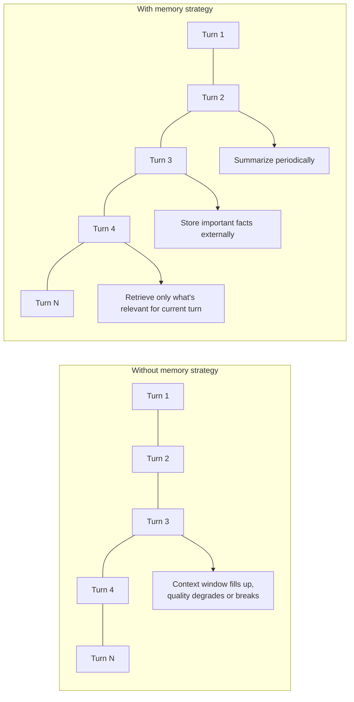
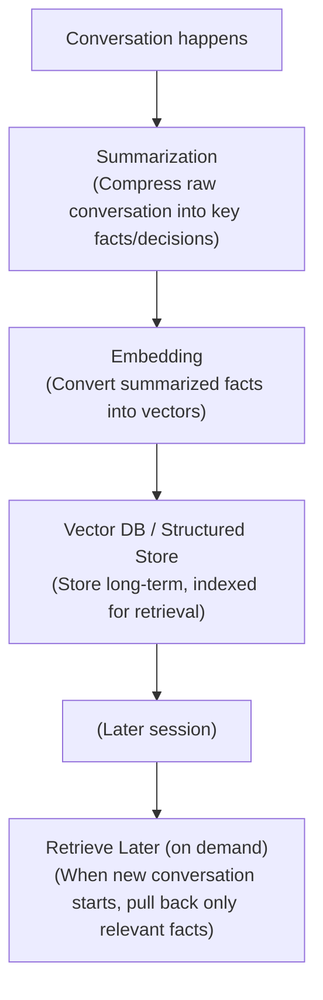
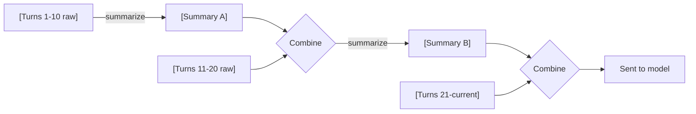

# Module 3: Memory

> **Goal of this module:** Understand how an agent retains information across a single conversation and across separate sessions entirely. Module 2 gave the agent a loop; this module gives it a persistent state — without memory, every agent conversation restarts from zero, which is neither how humans work nor how any useful assistant behaves.

---

## 1. Why Memory Is a Separate Problem From Context

From Module 1: the context window is finite, and everything (system prompt, conversation history, tool results) shares that same budget. A naive agent that just appends every message and every tool result forever will eventually either exceed the context window or degrade in quality well before that ("lost in the middle").

**Memory is the set of strategies for deciding: what gets kept, what gets compressed, what gets stored externally, and what gets retrieved back in when relevant** — rather than relying on "keep everything in the raw context forever."



---

## 2. Types of Memory

These categories borrow directly from cognitive science, and the analogy is genuinely useful, not just decorative.

| Type | What it is | Agent equivalent |
|---|---|---|
| **Working memory** | What you're actively holding in mind *right now* for the current task | The current context window / active prompt — the immediate scratchpad for the current reasoning step |
| **Short-term memory** | Recent info, still needed for continuity, but not "current task" | The recent conversation turns kept in context; not yet compressed or discarded |
| **Long-term memory** | Info retained indefinitely, retrieved only when relevant | External storage (DB/vector store) — facts, preferences, past interactions retrieved on demand |
| **Episodic memory** | Memory of specific past *events/experiences* ("last Tuesday we discussed X and decided Y") | A log of past sessions/interactions, timestamped, retrievable by "what happened when" |
| **Semantic memory** | General facts/knowledge, decoupled from *when* they were learned ("the user prefers Python over Node.js") | A structured or embedded fact store — durable user/domain facts, not tied to a specific conversation event |

**The distinction that matters most in practice: episodic vs semantic.**
- Episodic: "In our conversation on July 3rd, the user said they left their job at Bugraid." (tied to a specific event/time)
- Semantic: "The user is currently job-hunting." (a durable fact, doesn't matter which conversation it came from)

Most production memory systems (including the one powering Claude's own memory feature, conceptually) extract **semantic facts** from **episodic conversations** — the raw conversation is the episodic record, but what gets stored long-term and reused is the distilled semantic fact.

---

## 3. The Memory Pipeline



**Key design point:** retrieval into memory should be *selective*, not exhaustive. Just like Module 5's retrieval concepts (which this pipeline is a direct application of), pulling back everything defeats the purpose — the goal is relevant context, not maximum context.

---

## 4. Short-Term Memory Strategies (Within a Session)

These are the practical techniques for managing the context window during a single, possibly long, conversation.

**a) Sliding window** — keep only the last N turns, drop older ones entirely.
- Simple, but loses potentially important earlier context permanently.

**b) Rolling summarization** — periodically (e.g., every 10 turns), ask the LLM to summarize the conversation so far into a compact form, replace the raw turns with the summary, and continue.

- Keeps context bounded while preserving the gist of everything that came before.
- Risk: summarization is lossy — specific details (exact numbers, exact phrasing) can get smoothed over. For agentic tasks where exact values matter (e.g., a specific ID or amount), don't rely on summarization alone — extract and store those as structured facts instead (see semantic memory).

**c) Token-budget trimming** — actively count tokens (from Module 1) and truncate/drop oldest content once a threshold is hit, rather than waiting for a hard API failure.

---

## 5. Long-Term Memory Strategies (Across Sessions)

This is where memory becomes genuinely agentic infrastructure rather than just "conversation history management."

**a) Fact extraction** — after a conversation (or periodically during one), run an extraction step: "What durable facts about the user/task should be remembered?" Store these as discrete, structured entries (not the whole raw conversation).

```python
extraction_prompt = """
Extract durable facts worth remembering long-term from this conversation.
Return JSON: a list of {"fact": string, "category": string}.
Only include facts likely to be relevant in future, unrelated conversations
(preferences, ongoing projects, stated goals) — not one-off details.
"""
```

**b) Vector-based semantic retrieval** — embed each stored fact (Module 5), and at the start of a new session, embed the new query and retrieve only the top-K most relevant stored facts, rather than loading a user's entire history.

**c) Structured/relational storage** — not everything belongs in a vector DB. Facts with clear structure (user's job title, target salary range, preferred tech stack) are often better stored as structured key-value or relational data queried directly, reserving vector search for genuinely unstructured or fuzzy-match content. Production memory systems are usually **hybrid**: structured store for clean facts + vector store for fuzzy/semantic recall.

**d) Recency and relevance weighting** — a fact from 6 months ago ("wants to work in India") might be stale if a more recent fact contradicts it ("now targeting UAE roles"). Good memory systems weight by recency and allow newer facts to supersede older contradictory ones, rather than just retrieving by similarity alone.

---

## 6. Implementation Sketch (Python)

A minimal illustration of the extract → store → retrieve pattern (using a vector DB conceptually — concrete DB choices are covered in Module 5):

```python
import anthropic
import json

client = anthropic.Anthropic()

def extract_facts(conversation_text: str) -> list[dict]:
    response = client.messages.create(
        model="claude-sonnet-4-6",
        max_tokens=512,
        messages=[{
            "role": "user",
            "content": f"""Extract durable, long-term-relevant facts from this
conversation. Return ONLY a JSON array of objects: [{{"fact": "...", "category": "..."}}].
No other text.

Conversation:
{conversation_text}"""
        }]
    )
    raw = response.content[0].text.strip().strip("```json").strip("```")
    return json.loads(raw)

def store_facts(facts: list[dict], vector_db, embed_fn):
    for f in facts:
        vector = embed_fn(f["fact"])
        vector_db.upsert(vector=vector, metadata=f)

def retrieve_relevant_facts(query: str, vector_db, embed_fn, top_k=5):
    query_vector = embed_fn(query)
    return vector_db.query(vector=query_vector, top_k=top_k)

# Usage at the start of a new session:
new_query = "Help me prep for a system design interview"
relevant_facts = retrieve_relevant_facts(new_query, vector_db, embed_fn)
# → e.g. retrieves "User is studying system design using their Reviso project
#   as a reference" — highly relevant; skips irrelevant facts like hobby details
```

---

## 7. Common Pitfalls

- **Storing everything, retrieving nothing selectively** — defeats the purpose; you've just moved the context-overload problem to a database instead of solving it.
- **No recency/contradiction handling** — stale facts silently override or coexist confusingly with updated ones (e.g., an old job listed as current after the user changed roles).
- **Treating summarization as lossless** — it isn't. Specific numbers, exact names, and precise commitments should be extracted as structured facts, not left to survive inside a fuzzy summary.
- **No user control/correction path** — a good memory system lets a user explicitly correct or remove a stored fact ("I no longer work at X") rather than only ever accumulating.
- **Sensitive data handling** — long-term memory stores can accumulate sensitive personal information over time; production systems need clear policies on what's excluded from persistent storage and how deletion requests are honored.

---

## Comparisons Table: Memory Strategies

| Strategy | Best for | Risk |
|---|---|---|
| Sliding window | Simple short conversations | Loses older context entirely |
| Rolling summarization | Long single-session conversations | Lossy on exact details |
| Fact extraction + vector store | Cross-session personalization | Needs a retrieval step to avoid overload |
| Structured key-value store | Clean, well-defined facts (job title, preferences) | Doesn't handle fuzzy/unstructured recall |
| Recency-weighted retrieval | Facts that can become stale/contradicted over time | Needs explicit "supersede" logic |

---

## Interview-Style Q&A

**Q1: Why isn't "just keep everything in the context window" a viable memory strategy?**
Context windows are finite and shared across system prompt, conversation history, and tool results (Module 1). Even within the limit, models attend less reliably to information buried in very long contexts ("lost in the middle"). Memory strategies exist to keep only what's relevant, not to maximize what's retained.

**Q2: What's the practical difference between episodic and semantic memory in an agent system?**
Episodic memory is tied to a specific past event/conversation ("on July 3rd, discussed X"). Semantic memory is a durable, event-independent fact ("user prefers Python"). Production systems typically extract semantic facts out of episodic conversations for long-term storage, rather than storing raw conversation logs as the primary long-term memory.

**Q3: Why might you use both a structured store and a vector store for long-term memory, rather than just one?**
Clean, well-defined facts (job title, target salary, preferred stack) are efficiently and precisely queried from structured/relational storage. Fuzzy or unstructured content benefits from vector-based semantic similarity search. Using only vector search on everything sacrifices precision on facts that have exact, structured answers; using only structured storage can't handle fuzzy recall.

**Q4: What's a concrete failure mode of relying purely on summarization for long-running conversations?**
Summarization is lossy — specific numbers, exact commitments, or precise phrasing can get smoothed over or dropped. If an agent needs to reliably recall an exact figure or specific decision made much earlier, that should be extracted and stored as a discrete fact rather than trusted to survive inside a rolling summary.

**Q5: How should a memory system handle two facts that contradict each other (e.g., an old vs new job)?**
Weight by recency and/or explicitly detect contradiction and supersede the older fact, rather than retrieving both with equal weight and letting the model try to reconcile ambiguous or conflicting context.

**Q6: What's the risk of retrieving too many facts into context at the start of a session?**
Same risk as any retrieval problem (Module 5) — irrelevant retrieved content adds noise, costs tokens, and can dilute the model's attention on what's actually relevant to the current query. Retrieval should be selective (top-K, relevance-filtered), not exhaustive.

---

## What's Next

**Module 4: MCP (Model Context Protocol)** — the emerging standard for how agents connect to external tools, data sources, and prompts in a consistent way, instead of every application building bespoke tool-calling integrations for every service.
