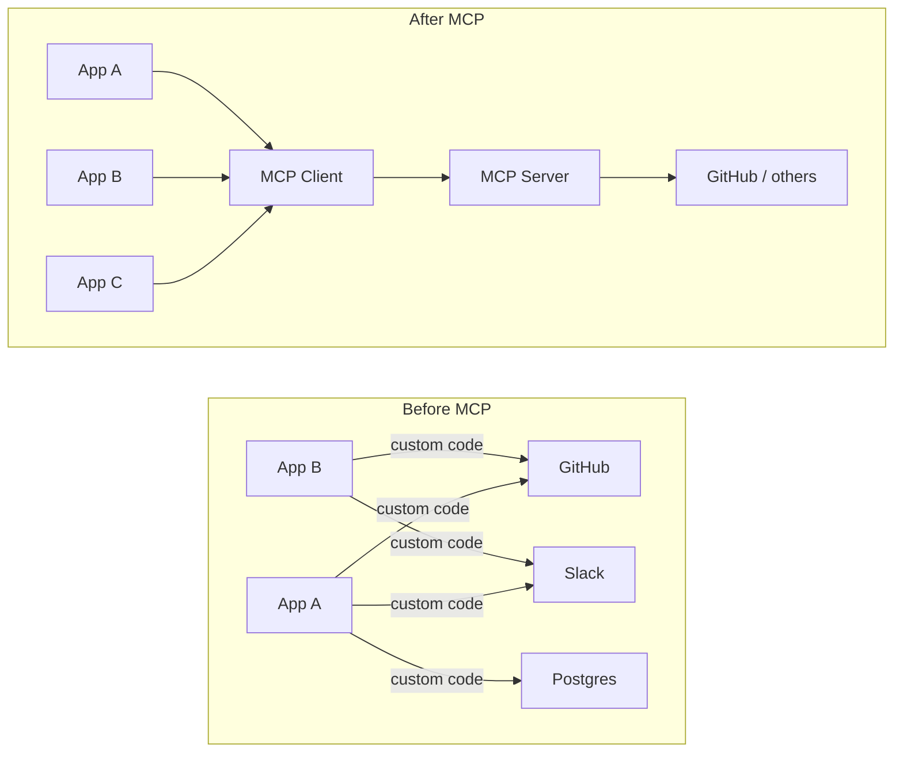
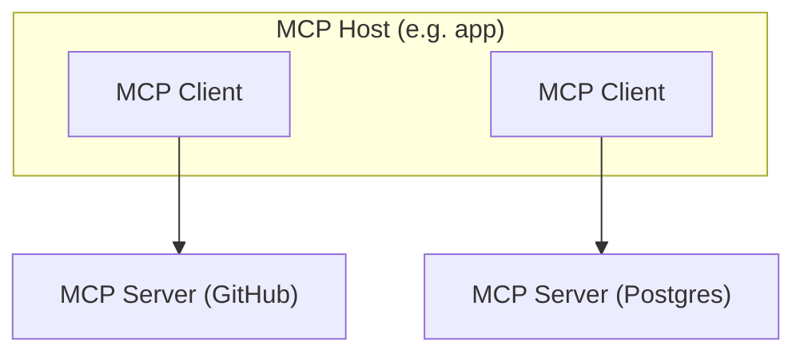
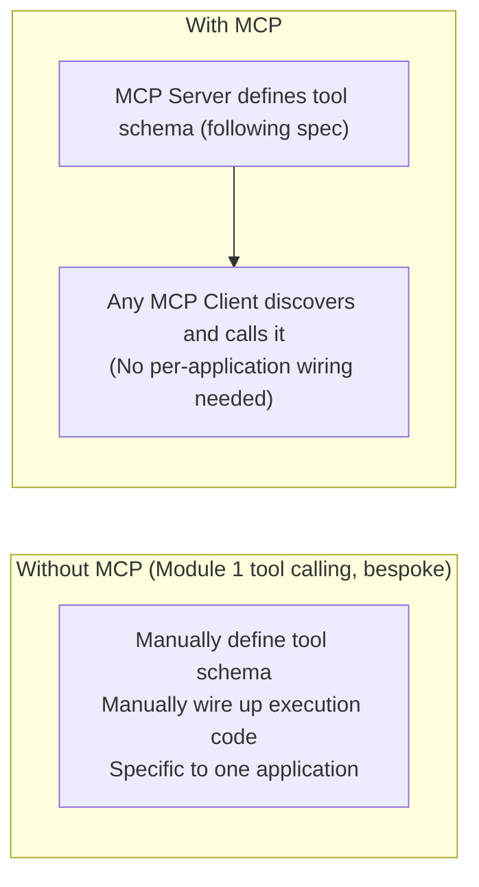

# Module 4: MCP (Model Context Protocol)

> **Goal of this module:** Understand what MCP actually standardizes, why it exists, and how it relates to the tool calling you already know from Module 1. MCP is not a new AI capability — it's a *protocol* (an agreed-upon interface) that makes the tool-calling and context-provisioning you already understand portable across different applications and providers.

---

## 1. The Problem MCP Solves

Before MCP, if you wanted an LLM application to work with, say, GitHub, Slack, and a Postgres database, you had to write **three separate bespoke integrations** — each with its own auth handling, its own way of describing available actions to the model, its own response parsing. If you then wanted to swap which LLM app was doing the calling (say, move from a custom app to Claude Desktop), you'd often have to rebuild those integrations again from scratch for the new host.



**The core idea:** MCP defines a standard client-server protocol so that *any* MCP-compatible application (the "client" / "host") can talk to *any* MCP-compatible tool/data provider (the "server") without custom integration work per pair. Write the server once; any MCP client can use it.

This is directly analogous to how USB standardized device connections (any USB device works with any USB port) instead of every device needing a proprietary cable — MCP does the same for "AI application ↔ external tool/data source."

---

## 2. Core Architecture: Client and Server

| Component | Role |
|---|---|
| **MCP Host** | The application the user interacts with (e.g., Claude Desktop, an IDE, a custom agent app). Contains one or more MCP Clients. |
| **MCP Client** | Lives inside the host, maintains a 1:1 connection to a specific MCP Server, handles the protocol-level communication. |
| **MCP Server** | Exposes a specific set of capabilities (tools, resources, prompts) from an external system (e.g., a GitHub MCP server, a Postgres MCP server, a Slack MCP server). |



A single host application can connect to many MCP servers simultaneously, each exposing a different domain of capability. This is exactly how, e.g., Claude.ai connects to Gmail, Google Calendar, and Google Drive as separate MCP-style connectors simultaneously.

---

## 3. The Three Primitives MCP Standardizes

MCP servers expose capabilities in three categories:

### a) Tools
Functions the model/agent can call — this is the *exact same concept* as Module 1's function/tool calling, just standardized so any MCP client can discover and invoke them the same way, regardless of which server provides them.

```json
{
  "name": "create_github_issue",
  "description": "Create a new issue in a GitHub repository",
  "inputSchema": {
    "type": "object",
    "properties": {
      "repo": {"type": "string"},
      "title": {"type": "string"},
      "body": {"type": "string"}
    },
    "required": ["repo", "title"]
  }
}
```

### b) Resources
Read-only data the host application can pull into context — think of these as addressable pieces of content (a file, a database record, a document) that the model can reference or a user can attach, rather than actions the model actively invokes.

```
resource://github/repo/my-project/README.md
resource://postgres/customers/table-schema
```

**Key distinction from Tools:** resources are typically *fetched* (often at the application's or user's initiative) to provide context, while tools are *called* by the model to take an action or retrieve dynamic results as part of its reasoning loop.

### c) Prompts
Pre-defined, reusable prompt templates that a server can expose — e.g., a "summarize this PR" prompt template bundled with a GitHub MCP server, so the host application (or user) can invoke a ready-made, well-tested prompt rather than everyone writing their own from scratch.

### d) Sampling (a less common but important primitive)
Lets an MCP **server** request that the **client's** LLM generate a completion on the server's behalf — inverting the usual direction. This allows a server to leverage the host's LLM access for its own internal logic without needing its own separate model/API key. Used more sparingly than tools/resources/prompts, but worth knowing it exists.

---

## 4. How This Connects to Module 1 and Module 2

**MCP does not introduce a new capability beyond tool calling — it standardizes the transport and discovery layer around it.**



In terms of the agent loop from Module 2 (Reason → Act → Observe → Repeat), MCP simply standardizes *how the "Act" step's available actions are discovered and invoked* — the loop itself doesn't change conceptually.

---

## 5. Minimal Python Example: A Simple MCP Server

This shows how little boilerplate is needed to expose a tool via MCP (using the official Python SDK conceptually):

```python
from mcp.server import Server
from mcp.types import Tool, TextContent

app = Server("weather-server")

@app.list_tools()
async def list_tools() -> list[Tool]:
    return [
        Tool(
            name="get_weather",
            description="Get current weather for a city",
            inputSchema={
                "type": "object",
                "properties": {"city": {"type": "string"}},
                "required": ["city"]
            }
        )
    ]

@app.call_tool()
async def call_tool(name: str, arguments: dict) -> list[TextContent]:
    if name == "get_weather":
        city = arguments["city"]
        # In real code: call an actual weather API
        result = f"{city}: Rain, 80% chance"
        return [TextContent(type="text", text=result)]
    raise ValueError(f"Unknown tool: {name}")

# Any MCP-compatible client (Claude Desktop, a custom agent host, an IDE)
# can now discover and call get_weather() without any custom integration
# code on the client side — it just speaks the MCP protocol.
```

Compare this to the Module 1 tool-calling example — the *tool definition shape* (name, description, input schema) is conceptually identical. What MCP adds is the standardized `list_tools`/`call_tool` protocol surface so this server works with *any* MCP client, not just one hand-wired application.

---

## 6. Why This Matters for Agentic AI Specifically

- **Composability** — an agent (Module 2) can gain new capabilities just by connecting to a new MCP server, without the agent's own code changing.
- **Ecosystem effects** — because it's an open standard, third parties build MCP servers for their own products (GitHub, Slack, databases, SaaS tools), and any agent host benefits without bespoke integration work — this is exactly the mechanism behind Claude's own connector ecosystem.
- **Separation of concerns** — the people building the agent's reasoning logic don't need to also be the people building/maintaining integrations to every external tool; those can be maintained independently as MCP servers by the tool's own provider.

---

## Comparisons Table: Traditional Tool Calling vs MCP

| | Traditional (bespoke) tool calling | MCP |
|---|---|---|
| Integration effort per tool | Custom code per application per tool | Write once (server), reusable across any MCP client |
| Discovery | Hardcoded in your application | Dynamic (`list_tools`) — client can discover what's available at runtime |
| Portability across apps | Low — tied to one application's code | High — any MCP-compatible host can use the same server |
| Maintenance | Every app maintains its own integration | Tool/data provider maintains one server; all clients benefit |
| Scope | Just tools (functions) | Tools + Resources + Prompts + Sampling |

---

## Interview-Style Q&A

**Q1: Is MCP a new AI capability, or something else?**
Something else — it's a standardized protocol for how AI applications (clients) discover and communicate with external tools/data sources (servers). The underlying capability (tool calling, from Module 1) already existed; MCP standardizes the interface so it doesn't need to be rebuilt bespoke for every application-tool pair.

**Q2: What's the difference between an MCP Tool and an MCP Resource?**
A Tool is an action the model actively calls as part of its reasoning loop, usually to retrieve dynamic results or cause a side effect. A Resource is addressable, typically read-only content (a file, a record, a document) that gets pulled into context, often at the application's or user's initiative rather than the model deciding to invoke it mid-reasoning.

**Q3: Why would a tool provider (e.g., GitHub) want to build an MCP server rather than just publishing an API?**
An API still requires every consuming application to write custom integration code. An MCP server, once built, is immediately usable by any MCP-compatible host application without that application needing bespoke integration work — it maximizes reach across the whole MCP client ecosystem for one build effort.

**Q4: What does the "Sampling" primitive let an MCP server do, and why is it unusual?**
It lets the server request that the client's LLM generate a completion on the server's behalf — the reverse of the usual client-calls-server direction. It's unusual because it means the server doesn't need its own separate model access; it borrows the host application's LLM connection. Used less frequently than tools/resources/prompts but architecturally notable.

**Q5: How does MCP relate to the agent loop from Module 2?**
It doesn't change the loop conceptually — Reason → Act → Observe → Repeat still applies. MCP standardizes how the "Act" step discovers what actions are available and how it invokes them, so the same agent loop can work across many different external systems without custom per-system wiring.

**Q6: What's a concrete downside or limitation of MCP worth being aware of?**
Since it's a relatively new, evolving standard, tooling maturity, security models (especially around what a connected server can access on a user's behalf), and versioning across different server implementations are still developing — worth treating as an evolving ecosystem rather than a fully settled one when making production architecture decisions.

---

## What's Next

**Module 5: Retrieval Fundamentals** — embeddings, similarity math, chunking strategies, vector databases, and dense/sparse/hybrid search. This is the foundational machinery behind RAG (Modules 6-7) and behind the long-term memory retrieval you saw in Module 3 — both are applications of the same underlying retrieval concepts covered next.

---

## 🛑 Common Pitfalls & Debugging

1. **Authentication Leaks**: Never pass sensitive API keys from the LLM client to the MCP server. The MCP server should manage its own secrets and environments.
2. **Assuming Client Capabilities**: The MCP Server provides the tools, but it cannot force the client to use them correctly. The client LLM must still be smart enough to understand the tool schemas.

```quiz
Q: What problem does the Model Context Protocol (MCP) primarily solve?
- [x] The N x M integration problem where every new AI app requires custom code for every new data source.
- [ ] The high cost of embedding models by replacing them with local alternatives.
- [ ] The context window limitation by infinitely compressing tokens.
Explanation: MCP standardizes how AI applications communicate with data sources and tools, meaning you write the integration once, and any MCP-compatible client can use it.
```
