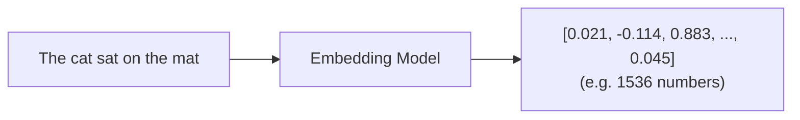
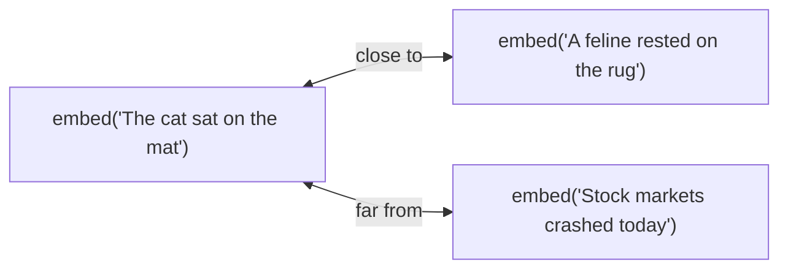
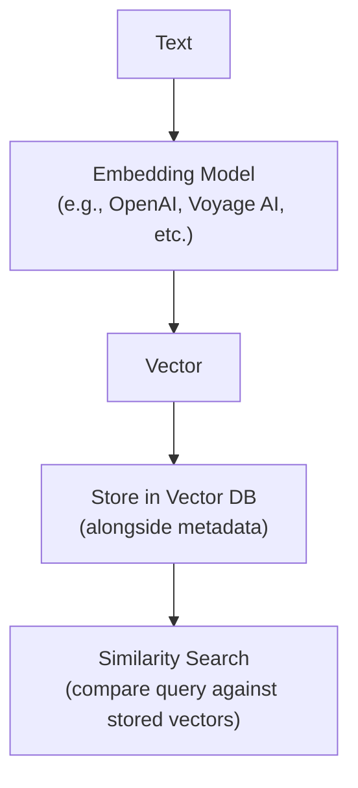
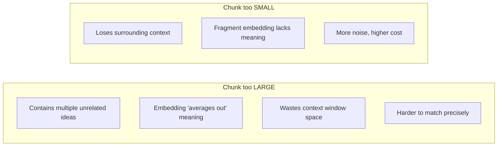
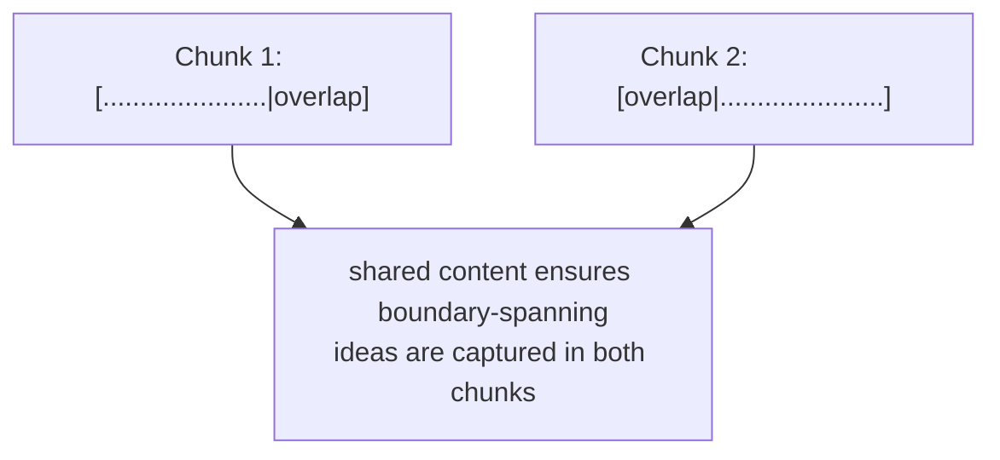
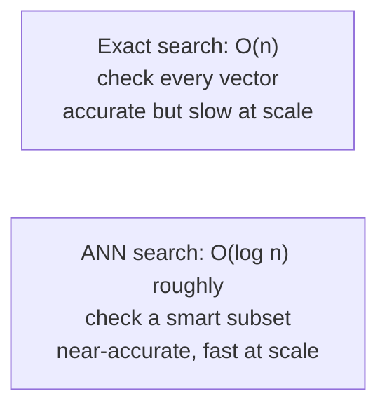
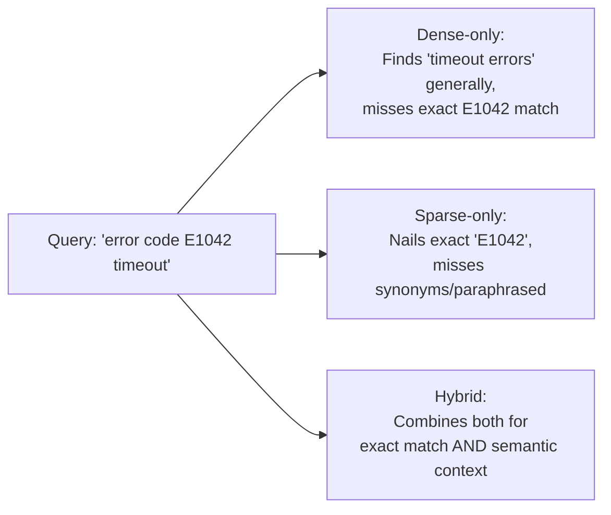

# Module 5: Retrieval Fundamentals

> **Goal of this module:** Understand the actual machinery behind "search over your own data" — embeddings, similarity math, chunking, vector databases, and dense/sparse/hybrid search. This module is the shared foundation behind Module 3's long-term memory retrieval and Modules 6-7's RAG — everything here is infrastructure, not a new agentic concept, but you cannot build a serious RAG or memory system without it being solid.

---

## 1. What Embeddings Actually Are

An **embedding** is a fixed-length vector (list of numbers) that represents the *meaning* of a piece of text, produced by a trained embedding model.



**Why this works at all:** the embedding model is trained so that pieces of text with *similar meaning* end up as vectors that are *close together* in that high-dimensional space, and dissimilar meanings end up far apart. This isn't hardcoded — it emerges from training on massive amounts of text where the model learns which words/phrases/sentences tend to appear in similar contexts (the distributional hypothesis: "you shall know a word by the company it keeps").

**Concretely:**

Even though the first pair shares almost no exact words, they're semantically similar — this is *why* embeddings beat plain keyword matching for meaning-based search.

**Embedding dimensions:** the length of the vector (e.g., 384, 768, 1536, 3072 depending on the model). More dimensions can capture more nuance but cost more storage and compute per comparison. This is a real trade-off, not just "bigger is always better" — many production systems use smaller embedding models (384-768 dim) because the accuracy gain from larger ones doesn't justify the storage/latency cost for their use case.

---

## 2. Similarity Math

Once you have vectors, you need a way to measure "how close" two vectors are. Three metrics dominate:

### Cosine Similarity
Measures the *angle* between two vectors, ignoring their magnitude. Ranges from -1 (opposite) to 1 (identical direction).

```
cosine_similarity(A, B) = (A · B) / (|A| × |B|)
```

**Most commonly used for text embeddings**, because what matters is the *direction* (semantic content) of the vector, not its length — two vectors pointing the same way represent similar meaning regardless of magnitude differences introduced by text length or model quirks.

### Euclidean Distance
Straight-line ("as the crow flies") distance between two points in vector space.

```
euclidean(A, B) = sqrt(Σ(Aᵢ - Bᵢ)²)
```

Sensitive to magnitude, not just direction — two vectors pointing the same direction but with different lengths will have nonzero Euclidean distance, whereas cosine similarity would treat them as identical. Used less often for text embeddings, but common in other ML contexts (e.g., comparing image feature vectors, clustering).

### Dot Product
```
dot_product(A, B) = Σ(Aᵢ × Bᵢ)
```
Related to cosine similarity but *not* normalized by vector length — magnitude matters. Some embedding models are specifically trained so that dot product alone (without normalization) gives good similarity rankings, which is computationally cheaper than cosine similarity (skips the division step). Whether to use dot product or cosine depends on how the specific embedding model was trained — check the model's documentation rather than assuming.

**Practical rule:** cosine similarity is the safe default for text embeddings unless the embedding model's documentation specifically recommends dot product (some do, for performance reasons, when vectors are already normalized).

```python
import numpy as np

def cosine_similarity(a, b):
    return np.dot(a, b) / (np.linalg.norm(a) * np.linalg.norm(b))

def euclidean_distance(a, b):
    return np.linalg.norm(np.array(a) - np.array(b))

def dot_product(a, b):
    return np.dot(a, b)
```

---

## 3. When to Regenerate Embeddings

Embeddings need to be regenerated when:
- **The source text changes** (obviously — the vector represents that specific text).
- **You switch embedding models** — vectors from different models are *not compatible* with each other. You cannot mix embeddings from Model A and Model B in the same similarity search; they exist in unrelated vector spaces even if dimensions happen to match.
- **The embedding model is updated/deprecated by the provider** — a "v2" of an embedding model is effectively a different model; old embeddings should be regenerated, not assumed compatible.

**This is a real production gotcha:** if you silently switch embedding models without re-embedding your entire existing dataset, similarity search results become meaningless (comparing vectors from incompatible spaces) with no obvious error — just quietly bad retrieval quality.

---

## 4. The Embedding Pipeline



This exact pipeline is what powers: Module 3's long-term memory retrieval, and Modules 6-7's RAG retrieval. Same machinery, different content being embedded (facts vs. document chunks).

---

## 5. Chunking

**This is probably the most underrated, most-often-done-badly part of any retrieval system.** Chunking is how you split source documents into smaller pieces *before* embedding them — you rarely embed an entire document as one vector, because a single vector can't represent all the distinct ideas in a long document, and you want to retrieve only the *relevant part*, not the whole document.

### Why chunk size matters so much



### Chunking Strategies

**a) Fixed-size chunking** — split every N tokens/characters, regardless of content structure.
- Simplest to implement. Risk: cuts sentences/ideas mid-thought at arbitrary boundaries.

**b) Sentence chunking** — split on sentence boundaries, group N sentences per chunk.
- Respects natural language boundaries, but sentence length varies wildly, so chunk size still varies.

**c) Paragraph chunking** — split on paragraph boundaries.
- Good when paragraphs are already coherent semantic units (well-written docs); bad on poorly formatted source content.

**d) Semantic chunking** — use embeddings themselves to detect where meaning shifts, and split there rather than at a fixed size or fixed structural marker.
- Most content-aware, best boundary quality; more computationally expensive (requires embedding calls just to decide chunk boundaries).

**e) Recursive chunking** — try splitting by the largest structural unit first (e.g., section), and if a piece is still too large, recursively split by the next smaller unit (paragraph, then sentence), until chunks fit the target size.
- A very common practical default (e.g., LangChain's `RecursiveCharacterTextSplitter`) — balances structure-awareness with a hard size guarantee.

**f) Markdown-aware chunking** — split respecting markdown structure specifically (headers, code blocks, lists) so a chunk doesn't, e.g., cut a code block in half or separate a header from its content.
- Directly relevant to *this very handbook* — a naive fixed-size chunker would happily slice through the middle of one of these Python examples.

**g) Code chunking** — split source code respecting syntactic units (functions, classes) rather than arbitrary line counts, typically using the language's AST (abstract syntax tree) or at minimum indentation/bracket awareness, so a function definition doesn't get split from its body.

### Chunk Overlap

Adjacent chunks often **overlap** by a small amount (e.g., last 50 tokens of chunk N repeated as the first 50 tokens of chunk N+1) so that an idea spanning a chunk boundary isn't lost entirely from both chunks' embeddings.



**Trade-off:** more overlap = better boundary coverage, but more storage and some retrieval redundancy (near-duplicate chunks competing for top-K slots).

### Practical Guidance
- There's no universal "correct" chunk size — it depends on the embedding model's effective range, the nature of the content, and the retrieval task. Common starting points: 256-512 tokens for general prose, with 10-20% overlap.
- **Always chunk according to content structure when possible** (markdown-aware, code-aware, recursive) rather than blind fixed-size — the "why chunks too large fail / too small lose context" trade-off above is best mitigated by respecting natural content boundaries, not just tuning a size number.

---

## 6. Vector Databases

A vector database stores embeddings (plus metadata) and provides fast similarity search over potentially millions/billions of vectors — something a naive "compare against every vector one by one" approach can't do at scale.

### Popular options

| DB | Notes |
|---|---|
| **Pinecone** | Fully managed, cloud-only, easy to start, popular in production SaaS |
| **Weaviate** | Open-source, can self-host or use managed cloud, supports hybrid search natively |
| **Qdrant** | Open-source, Rust-based (fast), strong metadata filtering, self-hostable |
| **Chroma** | Lightweight, popular for local development/prototyping, easy Python integration |
| **FAISS** | Not a full database — a library (from Meta) for efficient similarity search; you build the storage/serving layer around it yourself |
| **Milvus** | Open-source, built for large-scale production workloads, more operational complexity |

### Core Concepts

- **Index** — the underlying data structure enabling fast approximate search (see ANN below) over the stored vectors.
- **Collections** — a named grouping of vectors (analogous to a table in a relational DB) — e.g., a "product-docs" collection vs. a "support-tickets" collection.
- **Namespaces** — a further partition within a collection, often used for multi-tenancy (e.g., one namespace per customer, so searches stay scoped and isolated).
- **Metadata filtering** — narrowing a similarity search using structured filters alongside the vector comparison (e.g., "similar to this query, AND category = 'billing', AND date > 2026-01-01"). Critical for real applications — pure similarity search alone is rarely sufficient.
- **Hybrid search** — combining vector (semantic) search with traditional keyword search (see Module 6/dense-sparse discussion below) in one query, often producing better results than either alone.

### Approximate Nearest Neighbor (ANN) Search

Exact nearest-neighbor search (compare the query against literally every stored vector) doesn't scale — it's O(n) per query, unusable at millions of vectors with low-latency requirements. **ANN algorithms trade a small amount of accuracy for massive speed gains** by not guaranteeing the mathematically exact closest match, but getting extremely close, extremely fast.

- **HNSW (Hierarchical Navigable Small World)** — builds a multi-layer graph structure where each layer is a progressively coarser "shortcut" network; search starts at the sparse top layer and navigates down to precise results, similar to how a highway system lets you get across a country fast (highways) then navigate precisely at the end (local roads). Currently the most widely used ANN algorithm in production vector DBs due to strong speed/accuracy trade-offs.
- **IVF (Inverted File Index)** — partitions the vector space into clusters ("cells"); at query time, only searches within the most relevant cluster(s) rather than the whole dataset, trading some accuracy for speed by not exhaustively checking every cluster.
- **PQ (Product Quantization)** — compresses vectors into smaller approximate representations to reduce memory footprint and speed up comparisons, often combined with IVF (IVF-PQ) for large-scale systems where storing full-precision vectors for billions of items is impractical.



---

## 7. Dense vs Sparse vs Hybrid Retrieval

- **Dense retrieval** — the embedding-based similarity search described throughout this module. Captures semantic meaning, handles synonyms/paraphrasing well, but can occasionally miss exact keyword/term matches (e.g., a specific product code or acronym) since it's optimized for meaning, not literal string matching.
- **Sparse retrieval** — traditional keyword-based search (e.g., **BM25**, a ranking function that scores documents based on term frequency and inverse document frequency, refining older TF-IDF approaches). Excellent at exact term matches, bad at synonyms/paraphrasing ("car" won't match "automobile" the way dense retrieval would).
- **Hybrid retrieval** — combines both, typically by running dense and sparse search separately and merging/reranking the combined results (e.g., via **Reciprocal Rank Fusion**). Gets the best of both: semantic understanding from dense, precision on exact terms/codes/names from sparse.



**Practical rule:** hybrid search is increasingly the production default for serious retrieval systems, specifically because real queries mix "needs exact match" (IDs, names, codes) and "needs semantic understanding" (paraphrased questions) — pure dense or pure sparse alone leaves a real gap the other one covers.

---

## Comparisons Table: Vector DB Selection

| Priority | Good fit |
|---|---|
| Fastest to start, fully managed | Pinecone |
| Open-source + strong hybrid search built-in | Weaviate |
| Self-hosted + strong metadata filtering + speed | Qdrant |
| Local dev/prototyping | Chroma |
| Just need the ANN algorithm, building your own serving layer | FAISS |
| Large-scale production, willing to manage more infra | Milvus |

## Comparisons Table: Similarity Metrics

| Metric | Sensitive to magnitude? | Common use |
|---|---|---|
| Cosine similarity | No (direction only) | Default for text embeddings |
| Euclidean distance | Yes | Clustering, image features, some non-text ML |
| Dot product | Yes (unless vectors pre-normalized) | Used when embedding model is trained for it — cheaper compute |

---

## Interview-Style Q&A

**Q1: Why does cosine similarity ignore vector magnitude, and why does that matter for text embeddings?**
Cosine similarity measures the angle between vectors, not their length. For text, what matters is semantic *direction* (meaning) — two texts about the same topic should point the same way in vector space regardless of length-related magnitude differences introduced by the embedding process. Euclidean distance or raw dot product would be sensitive to magnitude, potentially penalizing semantically identical content that happens to produce different-length vectors.

**Q2: Why can't you mix embeddings from two different embedding models in the same similarity search?**
Each embedding model learns its own vector space during training — the geometry (what "close" means, what each dimension roughly captures) is specific to that model. Vectors from different models aren't comparable even if the dimensionality happens to match; similarity scores between them are essentially meaningless.

**Q3: What's the core trade-off in choosing chunk size?**
Too large: a chunk covers multiple ideas, its embedding becomes a vague average, and retrieval precision drops, while also wasting context window space with mostly-irrelevant content when retrieved. Too small: a chunk loses surrounding context needed to understand what it's actually about, hurting both embedding quality and answer quality even if the chunk is correctly retrieved.

**Q4: Why use recursive or markdown/code-aware chunking instead of just fixed-size chunking?**
Fixed-size chunking ignores content structure and can cut sentences, code blocks, or logical sections in half at arbitrary points, degrading both chunk coherence and embedding quality. Structure-aware chunking respects natural boundaries (sections, functions, headers) while recursive chunking still guarantees a maximum size, combining the benefits of both.

**Q5: Why is exact nearest-neighbor search impractical at scale, and what does ANN trade off to solve it?**
Exact search requires comparing a query vector against every stored vector — O(n) per query — which becomes too slow at millions/billions of vectors for real-time applications. ANN algorithms (like HNSW) build index structures that let search skip most of the dataset, trading a small, usually negligible amount of accuracy (not guaranteed to find the mathematically exact closest vector) for dramatic speed gains.

**Q6: When would sparse (keyword) retrieval outperform dense (embedding) retrieval?**
When exact term matching matters — specific IDs, error codes, product names, acronyms — where a dense embedding might retrieve semantically related content but miss the literal exact match, while a sparse method like BM25 nails it directly via term matching.

**Q7: Why is hybrid search often the production default rather than picking dense or sparse alone?**
Real user queries mix both needs — some parts require semantic understanding (paraphrased questions, synonyms), other parts require exact matching (codes, names, specific terms). Dense retrieval alone can miss exact matches; sparse retrieval alone can miss semantically related but differently-worded content. Combining and reranking both (e.g., via Reciprocal Rank Fusion) captures both needs.

**Q8: What's the practical risk of choosing chunk overlap too aggressively (e.g., 50%+)?**
Significant storage overhead and near-duplicate chunks competing for the same top-K retrieval slots, which can crowd out genuinely distinct relevant content and waste both storage and the context window's limited space once chunks are retrieved.

---

## What's Next

**Module 6: RAG & Advanced RAG** — putting embeddings, chunking, vector DBs, and retrieval together into the full Retrieval-Augmented Generation pipeline, plus the advanced variants (query rewriting, CRAG, Self-RAG, Adaptive RAG, parent-child/multi-vector retrieval, Graph RAG) that address the failure modes of naive RAG.

---

## 🛑 Common Pitfalls & Debugging

1. **Wrong Embedding Model at Query Time**: If you index your documents using OpenAI's 	ext-embedding-3-small, but embed the user's query using 	ext-embedding-ada-002, the vectors will exist in completely different dimensional spaces and the search will fail completely.
2. **Catastrophic Chunking**: Slicing documents purely by character count (e.g., exactly every 500 characters) often splits sentences or code blocks right down the middle, destroying the semantic meaning.

```quiz
Q: Why is Hybrid Search generally preferred for production retrieval systems?
- [ ] It is much cheaper to compute than either Dense or Sparse search alone.
- [ ] It completely eliminates the need for an embedding model.
- [x] It combines semantic understanding (Dense) with exact keyword matching (Sparse).
Explanation: Dense search is great for meaning but bad at exact names/IDs. Sparse is great at exact names/IDs but bad at synonyms. Hybrid combines the strengths of both.
```
