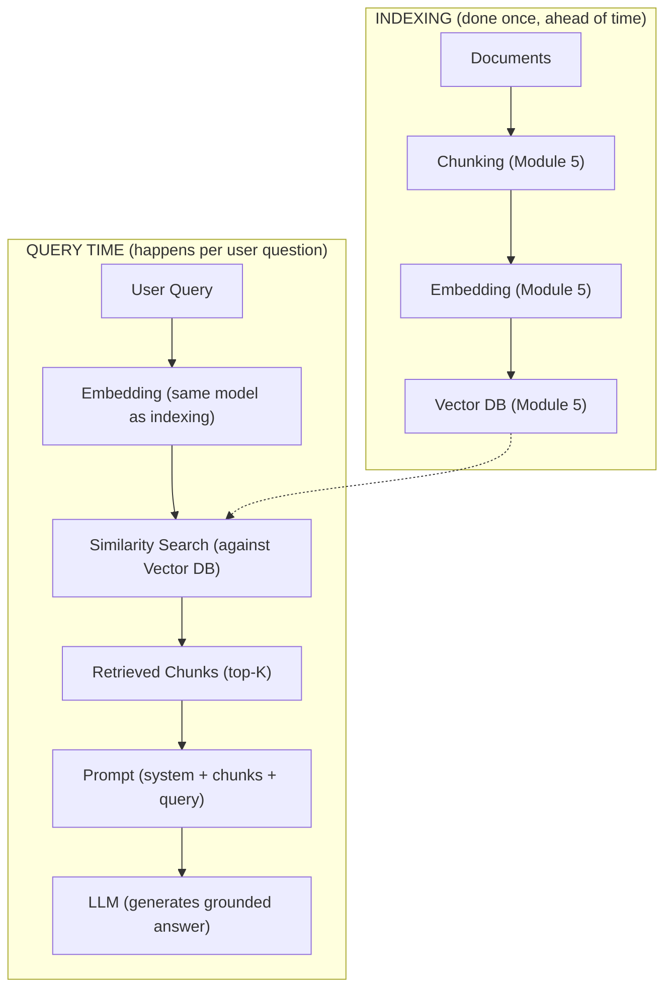
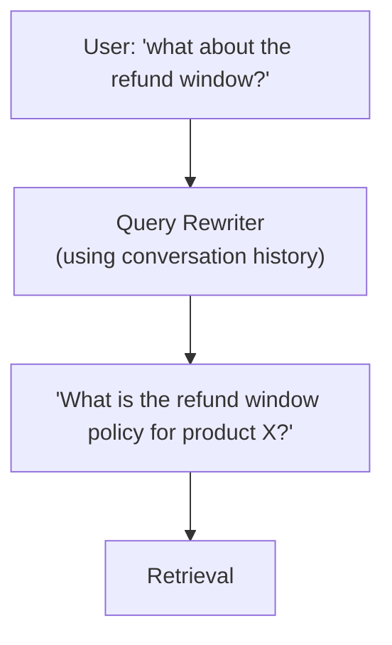
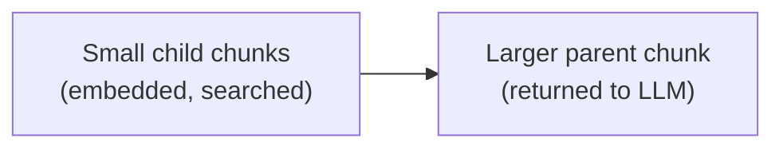
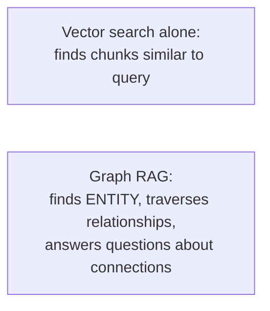
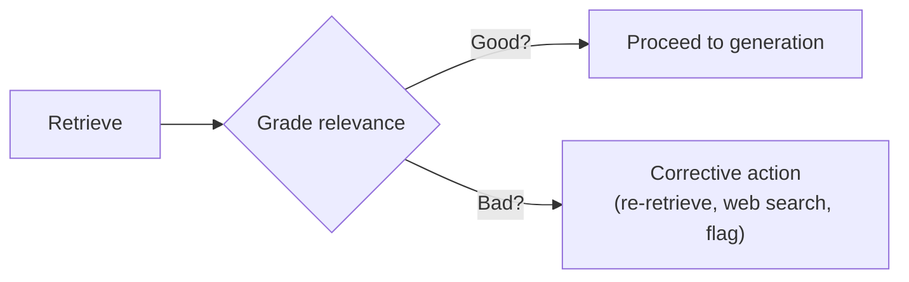
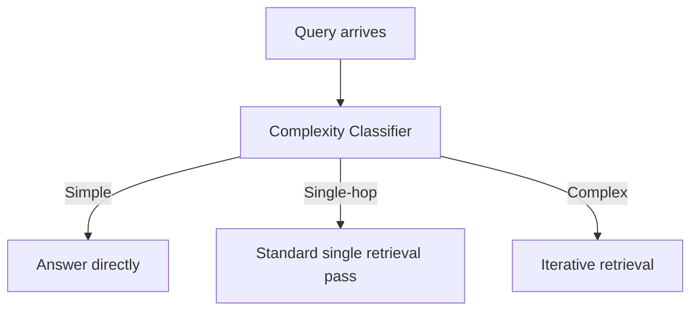
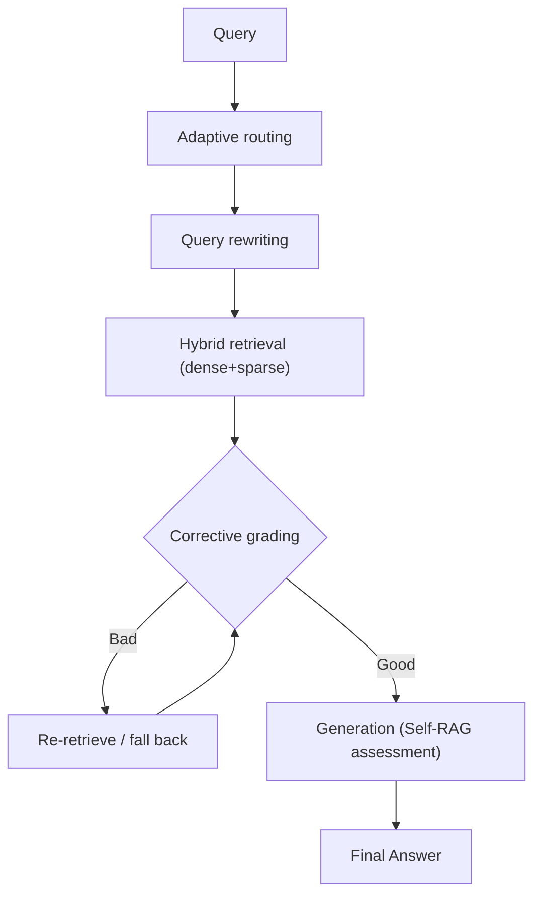

# Module 6: RAG & Advanced RAG

> **Goal of this module:** Understand how the pieces from Module 5 (embeddings, chunking, vector DBs, retrieval) assemble into a full Retrieval-Augmented Generation pipeline, why naive RAG breaks in predictable ways, and the advanced techniques that address those specific failure modes. RAG is not a single technique — it's a design space, and this module maps that space.

---

## 1. What RAG Actually Solves

An LLM's knowledge is frozen at training time and limited to what it learned from training data. **RAG (Retrieval-Augmented Generation)** solves two problems at once:

1. **Freshness** — the model can answer using up-to-date or private information it was never trained on (your company's docs, today's news, a user's own files).
2. **Grounding** — the model's answer can be traced back to specific retrieved source content, reducing hallucination and enabling citation, rather than relying purely on parametric (memorized) knowledge which may be wrong or outdated.

**The core idea:** instead of asking the model to answer purely from what it "remembers," you first retrieve relevant content from an external knowledge source, then give the model that content as context alongside the question, and ask it to answer *using* that content.

---

## 2. The Full RAG Pipeline

This connects directly to Module 5 — RAG is the applied end-to-end system that Module 5's individual pieces (chunking, embedding, vector DB, retrieval) exist to serve.



**Critical detail easy to overlook:** the same embedding model must be used for both indexing (documents) and query time. Mismatched models produce vectors from incompatible spaces (Module 5, §3) — this is one of the most common real-world RAG bugs.

**Minimal Python sketch:**

```python
import anthropic

client = anthropic.Anthropic()

def rag_answer(query: str, vector_db, embed_fn, top_k=5) -> str:
    query_vector = embed_fn(query)
    retrieved = vector_db.query(vector=query_vector, top_k=top_k)
    context = "\n\n---\n\n".join(chunk.text for chunk in retrieved)

    prompt = f"""Answer the question using ONLY the context below.
If the context doesn't contain the answer, say so — do not guess.

Context:
{context}

Question: {query}"""

    response = client.messages.create(
        model="claude-sonnet-4-6",
        max_tokens=1024,
        messages=[{"role": "user", "content": prompt}]
    )
    return response.content[0].text
```

The `"If the context doesn't contain the answer, say so"` instruction matters more than it looks — it's a first-line defense against the model filling gaps with hallucinated content instead of admitting the retrieved context was insufficient.

---

## 3. Why Naive RAG Breaks

Understanding the specific failure modes is what motivates every "advanced RAG" technique below — each one exists to fix a particular, identifiable problem, not as a generic upgrade.

| Failure mode | What happens | Root cause |
|---|---|---|
| **Bad query, bad retrieval** | User's literal phrasing doesn't match how the answer is phrased in source docs | Query embedding doesn't align well with relevant chunk embeddings |
| **Irrelevant chunks retrieved** | Top-K includes chunks that are superficially similar but not actually useful | Similarity ≠ relevance; embeddings capture topical closeness, not "does this answer the question" |
| **Answer needs multiple chunks, only one retrieved** | Question requires synthesizing info spread across several docs/chunks | Fixed top-K retrieval treats each chunk independently, doesn't reason about coverage |
| **Retrieved chunk lacks context** | A relevant chunk is retrieved, but it references "it" or "the policy" without saying which one | Chunking (Module 5) severed the chunk from its surrounding context |
| **Model ignores retrieved content, hallucinates anyway** | Even with correct context provided, model answers from parametric memory instead | No grounding enforcement / weak prompting |
| **No way to know if the answer was actually correct** | System has no self-check step | Naive RAG is a single forward pass — retrieve once, generate once, done |

---

## 4. Advanced RAG Techniques

Each technique below is a direct answer to one or more of the failure modes above.

### a) Query Rewriting
**Fixes:** bad query → bad retrieval.
Before searching, use the LLM to rewrite the user's raw query into a version better suited for retrieval — e.g., expanding abbreviations, making an ambiguous follow-up question self-contained, or generating multiple phrasings and retrieving for each.



### b) Parent-Child Retrieval
**Fixes:** retrieved chunk lacks context.
Index small, precise chunks for accurate *matching* (child chunks), but when a child chunk is retrieved, return its larger parent chunk/section to the LLM for *generation* — best of both: precise search, sufficient context.



### c) Multi-Vector Retrieval
**Fixes:** bad query, bad retrieval (for content where the "natural" search query differs from the content itself).
Instead of embedding the raw chunk text only, also generate and embed alternate representations of the same content — e.g., a summary of the chunk, or hypothetical questions the chunk would answer — and index all of them pointing back to the same source chunk. A user's actual query often looks more like "a question this content answers" than like "the content itself," so matching against generated hypothetical questions can outperform matching against raw text directly.

### d) Graph RAG
**Fixes:** answer needs multiple chunks / requires understanding relationships between entities.
Instead of (or alongside) a vector DB, build a **knowledge graph** — entities (people, products, concepts) as nodes, relationships as edges — extracted from the source documents. Retrieval can then traverse relationships ("what connects to X, and what connects to those things") rather than relying purely on semantic similarity, which is much better suited to multi-hop questions ("who reports to the manager of the person who approved this budget?") that plain chunk similarity search handles poorly.



### e) Corrective RAG (CRAG)
**Fixes:** irrelevant chunks retrieved, model ignores/hallucinates despite good context.
After retrieval, add an explicit **evaluation step**: a lightweight grader (often a smaller/cheaper LLM call) scores whether the retrieved chunks are actually relevant/sufficient. If they're graded as poor, the system takes a corrective action — e.g., fall back to a web search, rewrite the query and retry, or explicitly flag low confidence — rather than blindly feeding possibly-irrelevant chunks to the generation step.



### f) Self-RAG
**Fixes:** no way to know if the answer was actually correct; model ignores retrieved content.
The model is trained/prompted to generate special **reflection tokens** during generation — self-assessing things like "is retrieval even needed for this query," "is this retrieved passage relevant," and "is my generated answer actually supported by the passage." This makes the RAG process self-critiquing at a fine-grained level, rather than a blind single pass, directly extending the reflection concept from Module 2 into the retrieval pipeline specifically.

### g) Adaptive RAG
**Fixes:** unnecessary retrieval overhead, and under-retrieval for complex questions.
Not every query needs the same retrieval strategy — some queries need no retrieval at all (a simple greeting, or something answerable from general knowledge), some need single-step retrieval, and some need multi-step/iterative retrieval (complex, multi-hop questions). Adaptive RAG adds a routing step that classifies query complexity *first*, then chooses the appropriate retrieval strategy — rather than applying one fixed retrieval pipeline uniformly to every query regardless of whether it's actually needed.



---

## 5. How These Techniques Compose

These aren't mutually exclusive — production systems often stack several together:



Not every system needs every layer — this is the "maximal" composition. Start simple (naive RAG), and add specific advanced techniques only once you've identified which specific failure mode (from §3's table) is actually occurring in your system. Adding CRAG or Self-RAG complexity to solve a query-rewriting problem won't help — matching the technique to the diagnosed failure mode is the actual skill here.

---

## Comparisons Table: RAG vs Fine-Tuning (revisited from Module 1, now with full context)

| | RAG | Fine-tuning |
|---|---|---|
| Updates knowledge how | Swap/update the indexed documents — no retraining | Requires retraining on new data |
| Freshness | Easy — re-index anytime | Hard — requires a new training run |
| Grounding/citability | Strong — can point to exact retrieved source | Weak — no inherent source attribution |
| Best for | Knowledge that changes, needs citation, or is private/proprietary | Deep style/behavior shifts, tasks not well-described by adding context |
| Failure mode | Retrieval quality issues (this module's §3) | Catastrophic forgetting, stale without re-training |

## Comparisons Table: Advanced RAG Technique ↔ Failure Mode Fixed

| Technique | Primarily fixes |
|---|---|
| Query Rewriting | Bad query → bad retrieval |
| Parent-Child Retrieval | Retrieved chunk lacks surrounding context |
| Multi-Vector Retrieval | Query phrasing doesn't match content phrasing |
| Graph RAG | Multi-hop questions requiring entity relationships |
| Corrective RAG (CRAG) | Irrelevant chunks retrieved; no fallback when retrieval fails |
| Self-RAG | No self-assessment of relevance/groundedness during generation |
| Adaptive RAG | Uniform retrieval applied regardless of query complexity/need |

---

## Interview-Style Q&A

**Q1: What two distinct problems does RAG solve, and why does separating them matter?**
Freshness (accessing information beyond/after training data) and grounding (traceable, citable answers reducing hallucination). They're distinct because a system could have one without the other — e.g., a model could technically access fresh data but still not cite it well, or could ground answers in stale indexed data. Recognizing which problem you're actually solving shapes which advanced techniques matter for your use case.

**Q2: Why must the same embedding model be used at indexing time and query time?**
Different embedding models produce vectors in different, incompatible vector spaces (Module 5, §3) — a query embedded with Model B compared against documents embedded with Model A produces meaningless similarity scores, with no obvious error, just silently poor retrieval.

**Q3: What specific failure mode does Corrective RAG (CRAG) address that naive RAG can't?**
Naive RAG blindly feeds whatever the top-K retrieval returns to the LLM, even if those chunks are irrelevant. CRAG adds an explicit grading step after retrieval to catch this, enabling a corrective fallback (re-retrieval, web search, flagging low confidence) instead of silently generating from bad context.

**Q4: How does parent-child retrieval resolve the tension between small chunks (better matching) and large chunks (better context)?**
It indexes and searches against small, precise child chunks for accurate similarity matching, but returns the corresponding larger parent chunk/section to the LLM at generation time — decoupling what's optimized for search from what's optimized for having sufficient context to actually answer well.

**Q5: When would Graph RAG outperform standard vector-based RAG?**
For multi-hop questions that depend on explicit relationships between entities (e.g., "who approved the budget that funded the project this person manages") rather than topical similarity. Vector similarity search finds content *about* similar topics; it doesn't inherently reason about relationship chains between distinct entities the way a knowledge graph traversal can.

**Q6: What does Adaptive RAG add that a fixed single-strategy RAG pipeline lacks?**
A routing/classification step that assesses query complexity first, then chooses no-retrieval, single-step retrieval, or iterative multi-step retrieval accordingly — avoiding both wasted retrieval overhead on simple queries and under-retrieval on genuinely complex multi-hop queries that a single fixed retrieval pass can't adequately serve.

**Q7: Why shouldn't a team add every advanced RAG technique by default?**
Each technique specifically addresses a particular diagnosed failure mode (query mismatch, missing context, irrelevant retrieval, multi-hop reasoning, etc.) and adds real complexity/cost/latency. Applying, say, CRAG to fix a query-rewriting problem won't help — matching the specific technique to the specific observed failure (via evaluation, Module 9) is the actual engineering skill, not stacking every technique preemptively.

**Q8: How does Self-RAG relate to the "Reflection" concept from Module 2?**
Self-RAG applies the same core idea — a model assessing and critiquing its own output before finalizing — specifically to the retrieval pipeline, generating explicit signals about whether retrieval was needed, whether retrieved passages are relevant, and whether the final answer is actually grounded in them, rather than a general-purpose "is this good enough" reflection pass.

---

## What's Next

**Module 7: Agentic RAG** — where the agent loop (Module 2) and retrieval (Modules 5-6) genuinely intersect: an agent that decides *when* and *how* to retrieve as one of several tools available to it, potentially retrieving iteratively across multiple reasoning steps, rather than retrieval being a fixed, single pass bolted onto every query.

---

## 🛑 Common Pitfalls & Debugging

1. **Blind Generation (Naive RAG)**: Taking whatever the Vector DB returns and blindly pasting it into the LLM prompt. If the retrieval is irrelevant, the generation will be a hallucination based on irrelevant facts.
2. **Over-Engineering**: Implementing GraphRAG, CRAG, and Self-RAG before you even know if your users are asking complex multi-hop questions. Always start with Naive RAG and measure where it fails first.

```quiz
Q: What is the specific role of the "Grader" in Corrective RAG (CRAG)?
- [ ] To score the final answer generated by the LLM and give it a thumbs up/down.
- [x] To evaluate the retrieved documents BEFORE generation, triggering a fallback (like a web search) if they are irrelevant.
- [ ] To rewrite the user's query into a better format.
Explanation: CRAG intercepts the pipeline after retrieval. If the grader determines the chunks are poor quality, it corrects the course by rewriting the query or searching the web, rather than forcing the LLM to generate an answer from bad data.
```
