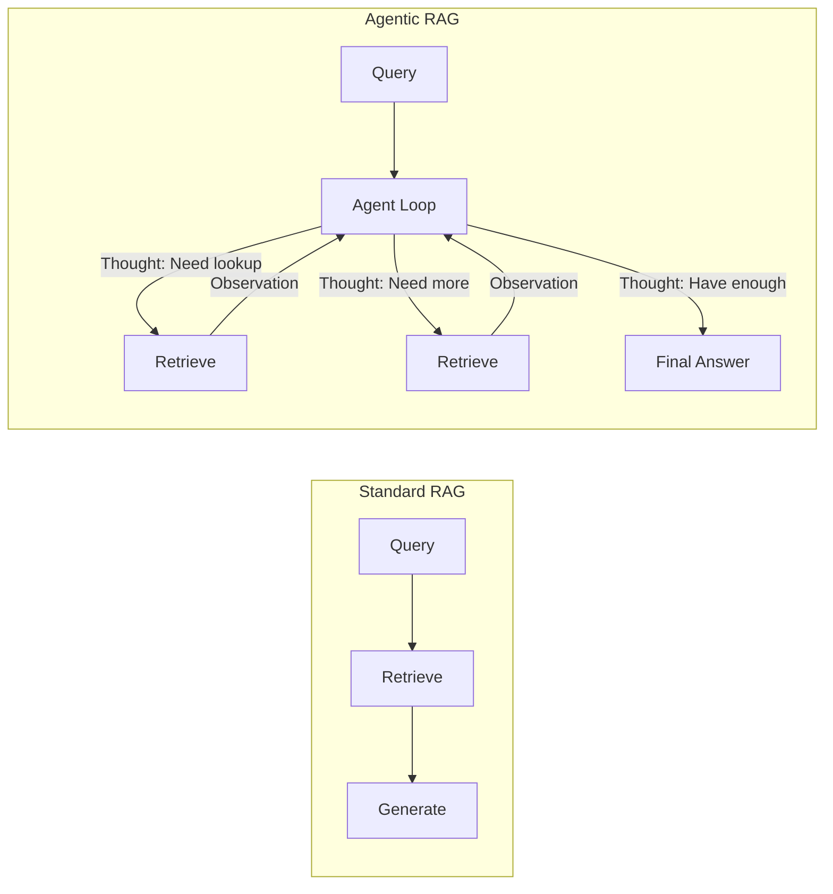
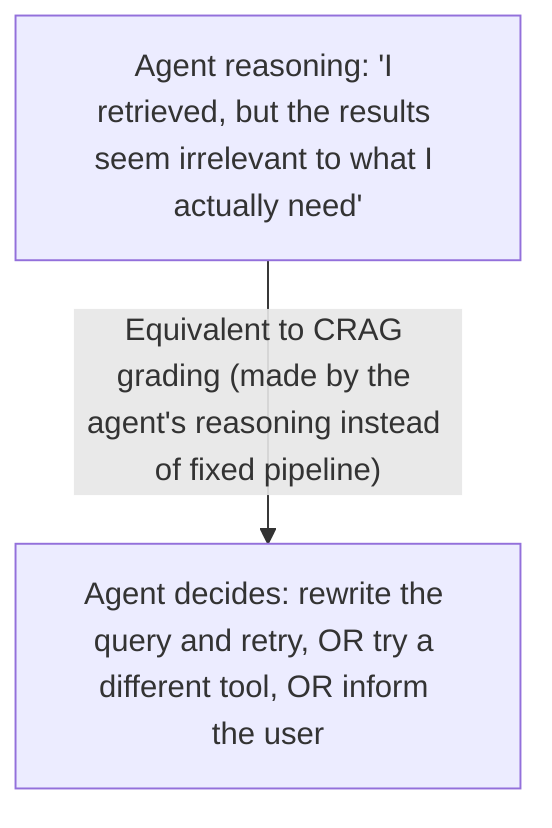

# Module 7: Agentic RAG

> **Goal of this module:** Understand the actual intersection of everything so far — where the agent loop (Module 2) treats retrieval (Modules 5-6) as just one tool among several, decided on dynamically, rather than retrieval being a fixed pipeline stage that runs the same way for every query. This is where "RAG" and "Agentic AI" stop being separate topics.

---

## 1. The Core Shift: Retrieval as a Decision, Not a Pipeline Stage

Every RAG variant in Module 6 — even Adaptive RAG — is still fundamentally a **pipeline**: query comes in, some fixed sequence of steps runs (maybe with branching), an answer comes out. The pipeline itself doesn't reason about its own process mid-execution beyond the branch points it was explicitly designed with.

**Agentic RAG removes that constraint entirely.** Retrieval becomes just another tool available to an agent operating in the loop from Module 2 (Reason → Act → Observe → Repeat). The agent decides, at each step, whether to retrieve, what to retrieve, whether one retrieval is enough, or whether it needs to retrieve again with a different query based on what it just learned — exactly the same way it would decide whether to call any other tool.



This is the direct application of Module 2's ReAct pattern, where one of the available "Actions" happens to be "search the vector DB" instead of (or alongside) "call an API" or "run code."

---

## 2. Why This Matters: What Fixed-Pipeline RAG Can't Do Well

| Limitation of pipeline RAG | How Agentic RAG addresses it |
|---|---|
| Retrieves once, generates once — no way to notice mid-answer that more info is needed | Agent can retrieve again based on what it learns from the first retrieval, as many times as needed |
| Fixed top-K regardless of question complexity | Agent decides how much retrieval is enough, stopping when it judges the answer is sufficiently grounded |
| Can't combine retrieval with other tool types dynamically | Agent can interleave retrieval with other tools (run code, call an API, check a calculator) as the reasoning demands, not in a predetermined order |
| Single query only — no reformulation based on partial results | Agent can reformulate its query based on what a first retrieval attempt revealed (similar to query rewriting, Module 6, but done iteratively and reactively rather than once upfront) |
| No mechanism to decide retrieval isn't even needed | Agent can skip retrieval entirely for a query it can answer directly, deciding this itself rather than relying on a separate upfront classifier (contrast with Adaptive RAG's dedicated routing step) |

**The key distinguishing feature versus Adaptive RAG specifically:** Adaptive RAG (Module 6) still has a fixed classify-then-route structure decided *before* execution begins. Agentic RAG makes this decision continuously, at every step of the loop, based on what's been observed so far — it's reactive and iterative rather than decided once upfront.

---

## 3. Retrieval as a Tool Definition

Since retrieval is just another tool in an agentic system, it's defined exactly the way any Module 1 tool is defined — with a name, description, and schema — so the agent can decide when to invoke it, the same way it decides to call `get_weather` or `run_sql_query`.

```python
tools = [
    {
        "name": "search_knowledge_base",
        "description": "Search the internal knowledge base for relevant information. Use this when you need specific facts, documentation, or context you don't already have.",
        "input_schema": {
            "type": "object",
            "properties": {
                "query": {"type": "string", "description": "The search query"}
            },
            "required": ["query"]
        }
    },
    {
        "name": "run_calculation",
        "description": "Perform a numeric calculation",
        "input_schema": {
            "type": "object",
            "properties": {"expression": {"type": "string"}},
            "required": ["expression"]
        }
    }
]
```

Note the model now has a genuine choice between two completely different tool types in the same reasoning step — retrieval isn't privileged or automatic; it's evaluated against the task exactly like any other action would be.

---

## 4. Worked Example: Multi-Step Agentic RAG Loop

**Task:** "What's the difference between our current refund policy and the one from last year, and does the new one apply to enterprise customers?"

This question needs: (a) the current policy, (b) last year's policy, (c) a specific detail about enterprise applicability — potentially in a different document than the general policy. A fixed single-retrieval RAG pipeline would likely retrieve one batch of chunks and hope they cover all three; an agentic approach retrieves iteratively, as the need for each piece becomes clear.

```python
import anthropic
import json

client = anthropic.Anthropic()

def search_knowledge_base(query: str, vector_db, embed_fn, top_k=3):
    query_vector = embed_fn(query)
    results = vector_db.query(vector=query_vector, top_k=top_k)
    return [r.text for r in results]

tools = [{
    "name": "search_knowledge_base",
    "description": "Search internal docs for relevant information",
    "input_schema": {
        "type": "object",
        "properties": {"query": {"type": "string"}},
        "required": ["query"]
    }
}]

messages = [{
    "role": "user",
    "content": "What's the difference between our current refund policy "
               "and last year's, and does the new one apply to enterprise customers?"
}]

while True:
    response = client.messages.create(
        model="claude-sonnet-4-6",
        max_tokens=1024,
        tools=tools,
        messages=messages
    )
    messages.append({"role": "assistant", "content": response.content})

    tool_calls = [b for b in response.content if b.type == "tool_use"]
    if not tool_calls:
        print("".join(b.text for b in response.content if b.type == "text"))
        break

    tool_results = []
    for call in tool_calls:
        chunks = search_knowledge_base(call.input["query"], vector_db, embed_fn)
        tool_results.append({
            "type": "tool_result",
            "tool_use_id": call.id,
            "content": json.dumps(chunks)
        })
    messages.append({"role": "user", "content": tool_results})

# Likely trace:
# 1st call: search_knowledge_base("current refund policy")
# 2nd call: search_knowledge_base("refund policy last year / 2025")
# 3rd call: search_knowledge_base("refund policy enterprise customers exceptions")
# → THEN produces final answer synthesizing all three retrievals
```

The agent decided, on its own, that this question needed three separate retrievals with three different queries — no developer pre-programmed "always retrieve 3 times" or wrote branching logic for this specific question shape. That autonomy is the entire point of this module.

---

## 5. Combining Agentic RAG with Advanced RAG Techniques (Module 6)

Agentic RAG doesn't replace Module 6's techniques — it's the framework that decides *when* to invoke them.



Similarly, Graph RAG's entity-traversal capability can just be exposed as another callable tool (`search_graph(entity)`) alongside `search_knowledge_base(query)` — the agent decides which retrieval *mechanism* fits the current sub-question, not just whether to retrieve at all.

---

## 6. Practical Risks and Design Considerations

- **Uncontrolled retrieval loops** — same risk as Module 2's reflection loops: without a cap, an agent could retrieve indefinitely, chasing diminishing returns. Set a max number of retrieval calls per turn, and/or a max total tool calls per user request.
- **Cost and latency compound quickly** — every retrieval is a vector search AND typically another LLM call to decide the next step. A question needing 5 iterative retrievals is 5x+ the latency/cost of single-shot RAG. This needs to be weighed against Module 6's Adaptive RAG idea — sometimes a simpler fixed pipeline is the right choice specifically because it's cheaper and the task doesn't need this much flexibility.
- **Debugging complexity** — because the retrieval path isn't fixed, the same question might retrieve differently across runs (especially at nonzero temperature). Good tracing/observability (Module 10) becomes essential, not optional, once retrieval is agent-driven rather than deterministic.
- **When NOT to use agentic RAG** — for simple, well-scoped Q&A over a small, well-organized knowledge base, standard or Adaptive RAG (Module 6) is simpler, cheaper, faster, and just as effective. Agentic RAG earns its complexity on genuinely multi-step, exploratory, or open-ended questions where the *right* retrieval strategy can't be known in advance — not as a default upgrade to every RAG system.

---

## Comparisons Table: RAG Variants at a Glance

| Approach | Retrieval decided by | Can retrieve iteratively? | Best for |
|---|---|---|---|
| Naive RAG (Module 6) | Always, fixed | No | Simple, single-hop Q&A |
| Adaptive RAG (Module 6) | Upfront classifier | No (single strategy chosen once) | Mixed query complexity, known ahead of time |
| Corrective RAG / Self-RAG (Module 6) | Fixed pipeline + grading/reflection step | Limited (one corrective retry, typically) | Improving reliability of a still-fundamentally-fixed pipeline |
| Agentic RAG (this module) | The agent itself, continuously, mid-reasoning | Yes — as many times as the agent judges necessary | Complex, multi-step, exploratory questions; combining retrieval with other tools dynamically |

---

## Interview-Style Q&A

**Q1: What's the fundamental difference between Adaptive RAG and Agentic RAG?**
Adaptive RAG classifies query complexity upfront and routes to a fixed retrieval strategy chosen once before execution. Agentic RAG makes the retrieve-or-not, what-to-retrieve, and retrieve-again decisions continuously, at every step of the agent loop, based on what's been observed so far — it's reactive and iterative rather than decided in a single upfront routing step.

**Q2: Why would an agent need to retrieve more than once for a single user question?**
Because the first retrieval might reveal that additional, different information is needed (e.g., a question with multiple sub-parts referencing different documents), or the first retrieval's results might be judged irrelevant/insufficient, prompting a reformulated query — situations a single fixed retrieval pass can't adapt to mid-execution.

**Q3: How does exposing retrieval "as a tool" change how it's treated in the system, compared to standard RAG?**
In standard RAG, retrieval is a privileged, always-executed pipeline stage. As a tool, it's just one option among several the agent can choose to invoke or not, based on its own reasoning about whether the current sub-task actually needs it — the same evaluation applied to any other tool call.

**Q4: What's a concrete risk of allowing unlimited iterative retrieval in an agentic RAG system?**
Uncontrolled retrieval loops can compound cost and latency significantly (each iteration is typically a vector search plus another LLM call), with diminishing returns on relevance. Production systems need a hard cap on retrieval iterations per request, similar to bounding reflection loops in Module 2.

**Q5: When would you deliberately choose standard/Adaptive RAG over Agentic RAG, even though Agentic RAG is more capable?**
When the knowledge base is small/well-organized and queries are mostly single-hop — the added latency, cost, and debugging complexity of an iterative agentic loop isn't justified if a simpler fixed pipeline already handles the task reliably. Agentic RAG's flexibility is a deliberate trade against simplicity and cost, not a strict upgrade in every case.

**Q6: How does Corrective RAG's grading step relate to what an agentic RAG system does naturally?**
CRAG's grading is a separate, explicit pipeline component bolted onto an otherwise fixed retrieval flow. In an agentic system, this same judgment ("were these results actually relevant/sufficient?") happens as part of the agent's own reasoning at each step, potentially leading it to retry retrieval or switch tools — the same outcome, but arising from the agent's general reasoning rather than a dedicated fixed component.

---

## 🛑 Common Pitfalls & Debugging

1. **Infinite Retrieval Loops**: The agent gets stuck repeatedly searching for the same information because it can't find what it needs but doesn't know how to stop. 
   - *Fix*: Implement a hard cap on the number of retrieval iterations (e.g., maximum 3 tool calls per turn).
2. **Context Window Exhaustion**: If the agent retrieves iteratively, it keeps appending chunks to the prompt. Eventually, you run out of tokens.
   - *Fix*: Make the agent explicitly summarize or discard irrelevant retrieved chunks before making the next retrieval call.

```quiz
Q: Why might you choose standard RAG over Agentic RAG?
- [x] Standard RAG is faster and cheaper for simple queries that only require one retrieval step.
- [ ] Agentic RAG is not capable of retrieving from Vector DBs.
- [ ] Agentic RAG always hallucinates more than standard RAG.
Explanation: Agentic RAG is powerful but adds latency and token costs because the agent has to think and iterate. For simple queries, a standard fixed RAG pipeline is far more efficient.
```

---

## What's Next

**Module 8: AI Architecture** — pulling every module so far (LLM fundamentals, agent loop, memory, MCP, retrieval, RAG, agentic RAG) into a single coherent production system diagram: frontend, backend API, LLM gateway, planner, tool router, vector DB, SQL, Redis, external APIs — how these pieces actually fit together end-to-end in a real deployed system.
