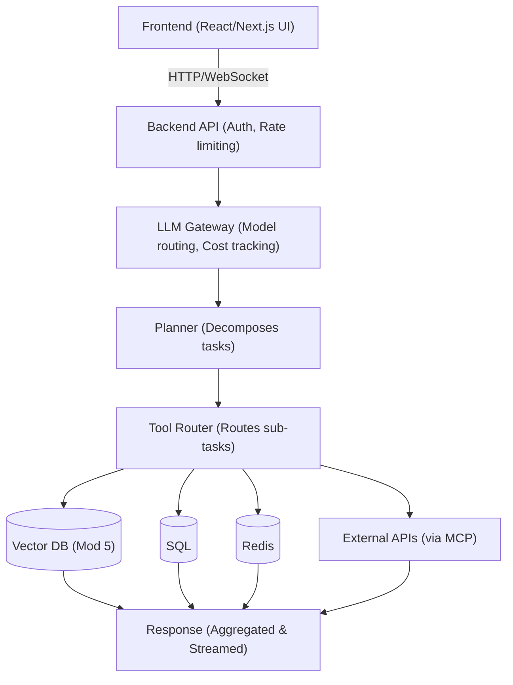

# Module 8: AI Architecture

> **Goal of this module:** Zoom out from individual concepts (agents, memory, MCP, RAG) to how they all actually fit together as a deployed system. This module is a synthesis, not new theory — every box in this module's architecture diagram is something you've already learned in Modules 1-7. The point here is understanding how they connect, where state lives, and where the real engineering trade-offs are.

---

## 1. The Full Production Architecture



Every box here maps directly to something already covered:
- **Frontend/Backend API** — standard web architecture, not AI-specific.
- **LLM Gateway** — where Module 1's model selection (chat vs reasoning models, fallback models) and Module 10's production concerns (retries, cost tracking) live.
- **Planner** — Module 2's planner role, deciding task decomposition.
- **Tool Router** — Module 2's agent loop's "Act" step, deciding which tool to invoke, using Module 1's tool-calling mechanism and Module 4's MCP standard where external systems are involved.
- **Vector DB** — Module 5, used for both RAG (Modules 6-7) and long-term memory (Module 3).
- **SQL / Redis** — the "boring" infrastructure every real system still needs: SQL for structured, relational data (user accounts, transaction records, structured facts from Module 3); Redis for fast key-value caching and short-term session state.
- **External APIs (via MCP)** — Module 4, standardized tool/data access to third-party systems.

---

## 2. Where State Actually Lives

A common confusion when first designing an agentic system: "isn't everything just in the LLM?" No — the LLM is stateless between calls (Module 1). Every piece of actual persistent state lives somewhere specific:

| State | Where it lives | Why |
|---|---|---|
| Current conversation (this session) | Redis (fast) or in-memory, short TTL | Needs fast read/write, doesn't need to survive long-term |
| User accounts, structured facts, transaction history | SQL (Postgres, MySQL, etc.) | Relational, needs consistency guarantees, exact-match queries |
| Long-term semantic memory (Module 3) | Vector DB + metadata | Needs similarity search, not exact match |
| Document/knowledge base content for RAG (Modules 6-7) | Vector DB (separate collection from memory, usually) | Same reasoning — needs semantic search |
| Cached LLM responses / expensive computation results | Redis | Avoid redundant expensive calls (Module 10 — caching) |
| Prompt templates and versions | Version-controlled config/database, not hardcoded in application code | Enables prompt versioning (Module 10) without redeploying application code |

**Why separate Redis and SQL, when both could technically store similar things?** Redis is optimized for speed (in-memory) at the cost of being less durable/structured by default — ideal for session state, caches, rate-limit counters. SQL is optimized for durable, relational, transactional data — ideal for anything that must survive permanently and maintain referential integrity (e.g., "this fact belongs to this specific user, and that relationship must never break"). Using Redis for what should be SQL data risks data loss; using SQL for what should be Redis (high-frequency cache lookups) adds unnecessary latency and load.

---

## 3. The LLM Gateway — Why It's Its Own Layer

It's tempting to think "the backend just calls the LLM API directly" — but a dedicated gateway layer earns its place in any serious system for several concrete reasons:

- **Model routing** — different sub-tasks may use different models (a cheap fast model for simple classification, an expensive reasoning model for complex planning — Module 1's chat-vs-reasoning distinction, applied). The gateway is where this routing decision is centralized rather than scattered across application code.
- **Fallback models** — if the primary model/provider has an outage or hits a rate limit, the gateway can transparently fall back to an alternate model, without every calling piece of code needing its own retry/fallback logic (Module 10).
- **Cost tracking and rate limiting** — centralizing all LLM calls through one layer makes it possible to actually measure and control spend, instead of cost tracking being scattered and incomplete.
- **Prompt versioning** — the gateway (or a service it calls) is a natural place to manage which prompt version is active, enabling A/B testing or rollback without redeploying the whole application.

---

## 4. The Planner and Tool Router — Splitting Responsibility

It's worth being explicit about why these are drawn as two separate boxes rather than one:

- The **Planner** answers: "What does this request actually require, at a high level?" (Module 2's planner role) — e.g., "this needs a database lookup, then a calculation, then a summary."
- The **Tool Router** answers: "For this specific sub-task, which concrete tool/system handles it?" — e.g., "the database lookup sub-task goes to the SQL tool; the summary sub-task doesn't need any tool at all, just direct generation."

Separating these lets you evolve them independently — you can add a new tool (a new MCP server, Module 4) without touching planning logic, and you can improve planning quality (e.g., swap in a stronger reasoning model, Module 1) without touching how individual tools are invoked.

---

## 5. A Concrete End-to-End Trace

**User request:** "Summarize what changed in our refund policy this year and email it to my manager."

```
Frontend → Backend API (auth check, rate limit check)
    │
    ▼
LLM Gateway → routes to reasoning-tier model for planning
    │
    ▼
Planner decomposes:
    1. Retrieve current and prior refund policy docs
    2. Summarize the differences
    3. Draft an email
    4. Send the email
    │
    ▼
Tool Router, per sub-task:
    Sub-task 1 → Vector DB (RAG retrieval, Modules 5-7)
    Sub-task 2 → no tool needed, direct LLM generation using retrieved content
    Sub-task 3 → no tool needed, direct LLM generation
    Sub-task 4 → External API via MCP (Module 4) — e.g., a Gmail MCP server
    │
    ▼
Response aggregated, confirmation streamed back to frontend:
    "I've summarized the changes and sent the email to your manager."
```

Every sub-task here maps to a concrete tool decision, and the whole trace is exactly Module 2's agent loop (Reason → Act → Observe → Repeat) operating at the level of this specific architecture's boxes.

---

## 6. Design Principles Worth Internalizing

- **Not every request needs the full pipeline.** A simple factual question shouldn't be forced through Planner → Tool Router → multiple systems if it can be answered directly by the LLM Gateway with no tools at all. This is the same principle as Module 6's Adaptive RAG and Module 7's "when NOT to use agentic RAG" — apply complexity only where the request actually demands it, not uniformly.
- **Stateless application layer, stateful data layer.** The backend API, LLM Gateway, Planner, and Tool Router should ideally be stateless themselves (any instance can handle any request) — all actual state lives in Redis/SQL/Vector DB. This is what makes the system horizontally scalable (Module 10 territory, but the architectural decision starts here).
- **Every external system access goes through a consistent interface.** Whether that's MCP specifically (Module 4) or just a consistent internal tool-calling convention (Module 1), avoid bespoke one-off integration code scattered throughout the application — it becomes unmaintainable as the number of integrated tools grows.
- **Observability needs to span the whole trace, not just individual boxes.** When something goes wrong, you need to see the full path a request took — which planner decision was made, which tools were called, what they returned — not just an isolated log line from one component. This motivates Module 9/10's tracing concepts, and it's why the "concrete end-to-end trace" example above is a useful mental model to build systems around from day one, not bolt on later.

---

## Comparisons Table: Where Different Data Belongs

| Data type | Best home | Why not the alternatives |
|---|---|---|
| Session/conversation state (current turn) | Redis | SQL adds unnecessary latency for high-frequency reads/writes; Vector DB isn't built for exact key lookups |
| User account, structured facts | SQL | Vector DB can't enforce relational integrity/exact match reliably; Redis isn't durable by default |
| Semantic memory / RAG documents | Vector DB | SQL can't do similarity search; Redis isn't built for high-dimensional vector search at scale |
| Cached expensive LLM outputs | Redis | SQL is slower for high-frequency cache reads; not worth the durability guarantees for disposable cache data |
| Prompt templates/versions | Versioned config store or DB, not hardcoded | Hardcoding prevents versioning/rollback without a full redeploy |

---

## Interview-Style Q&A

**Q1: Why is a dedicated LLM Gateway layer worth having instead of calling the LLM API directly from the backend?**
It centralizes model routing (different models for different task complexity), fallback handling (switching providers/models on failure), cost tracking, and prompt versioning — all things that become unmanageable if scattered across every place in the codebase that happens to call an LLM.

**Q2: Why separate the Planner and Tool Router into distinct components rather than one combined step?**
The Planner decides *what* the request requires at a high level (task decomposition); the Tool Router decides *which specific system* handles each resulting sub-task. Separating them lets you evolve each independently — e.g., add new tools without touching planning logic, or upgrade planning quality without touching tool invocation code.

**Q3: Why use both Redis and SQL rather than just one? Couldn't you store everything in SQL?**
Redis is optimized for speed (in-memory) — ideal for session state, caches, and rate-limit counters — but isn't durable/structured by default. SQL is optimized for durable, relational, transactional data. Using SQL for high-frequency cache-style reads adds unnecessary latency; using Redis for data that must persist reliably risks loss. They solve different problems.

**Q4: Why shouldn't every request go through the full Planner → Tool Router → multiple systems pipeline?**
Many requests (simple factual questions, greetings) can be answered directly by the LLM with no tools at all. Forcing every request through the full pipeline adds unnecessary latency and cost for no benefit — the same "match complexity to the actual need" principle as Adaptive RAG (Module 6) and knowing when not to use Agentic RAG (Module 7).

**Q5: Why does keeping the application layer (backend, gateway, planner, router) stateless matter architecturally?**
Statelessness means any instance of these components can handle any request, since all actual state lives in Redis/SQL/Vector DB rather than in the application process itself. This is what allows the system to scale horizontally (add more instances under load) without needing to worry about which instance "remembers" what.

**Q6: In the end-to-end refund policy/email example, why does sub-task 2 (summarizing differences) not require a tool call?**
Because once the relevant documents have already been retrieved (sub-task 1, via the vector DB), summarizing them is something the LLM can do directly from the provided context — no external system or action is needed, so routing it through the Tool Router to an external tool would be unnecessary overhead.

---

## 🛑 Common Pitfalls & Debugging

1. **Stateful Application Servers**: Storing conversation history in memory on the backend API server. When you scale to 2 servers, the user's second request hits the other server, and their history is "lost."
   - *Fix*: Always use an external fast database like Redis for session state.
2. **The Bottleneck Router**: Forcing every single user input through a slow, expensive planner LLM even if they just say "Hello."
   - *Fix*: Use a fast, cheap LLM or traditional regex/heuristics as a gateway to handle simple queries before invoking the heavy planner.

```quiz
Q: Why is keeping the application layer (like the Planner and Tool Router) stateless important in AI architecture?
- [ ] It makes the LLM hallucinate less.
- [x] It allows the system to scale horizontally since any server instance can handle any request.
- [ ] It prevents the vector database from running out of memory.
Explanation: Statelessness means all state is stored externally (e.g., in Redis or Postgres). This allows you to add or remove application servers dynamically based on traffic without losing user context.
```

---

## What's Next

**Module 9: Evaluation** — how you actually know if any of this architecture is working: hallucination detection, RAG-specific metrics (Precision@K, Recall@K, groundedness, faithfulness), and LLM-as-a-judge approaches. Everything built in Modules 1-8 needs a way to measure whether it's actually good, not just whether it runs.
